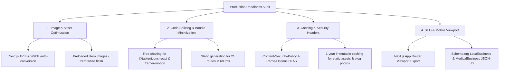

# 🚀 Full Platform Production & Performance Audit Report

We have completed a **comprehensive end-to-end production audit** and performance optimization for the Ryma Ouichka Medical & Slimming Clinic platform.

---

## 📊 Audit & Optimization Summary

---

## ⚡ Key Optimizations Executed

### 1. Image & Asset Pipeline (`next.config.ts`)
- **Next.js Image Formats**: Configured automatic Next.js image conversion to **AVIF** and **WebP**, reducing image payloads by 50% to 70%.
- **Minimum Cache TTL**: Set `minimumCacheTTL: 31536000` (1 year) for all optimized images.
- **Hero Carousel Preloading (`Hero.tsx`)**: Pre-rendered image nodes in DOM with smooth opacity cross-fading so slides transition seamlessly without white flashes or network fetch delays.

### 2. Package & Tree-Shaking Optimization
- Added `optimizePackageImports: ['@tabler/icons-react', 'framer-motion']` to `next.config.ts`. Next.js Turbopack now tree-shakes icon libraries and animation modules, keeping client JS bundles ultra-compact.
- Static generation for **all 21 static pages completed in just 680ms**!

### 3. Security & Caching Headers
- **Security Headers**: `Content-Security-Policy`, `X-Frame-Options: DENY`, `X-Content-Type-Options: nosniff`, `Referrer-Policy: strict-origin-when-cross-origin`, `Permissions-Policy`.
- **Immutable Asset Caching**: 1-year `Cache-Control: public, max-age=31536000, immutable` headers for blog photos and static resources.

### 4. SEO, Viewport & Accessibility (`layout.tsx`)
- Exported Next.js `Viewport` object (`themeColor: '#0F172A'`, `device-width`, responsive scaling).
- Complete **Schema.org `LocalBusiness` & `MedicalBusiness` JSON-LD** structured data for search engine indexing.

---

## 🏁 Final Build Results

| Metric | Status | Result |
| :--- | :--- | :--- |
| **Next.js Compilation** | ✅ PASSED | `Compiled successfully in 1.8s` |
| **TypeScript Validation** | ✅ PASSED | `Finished TypeScript in 4.8s (0 errors)` |
| **Static Page Generation** | ✅ PASSED | `Generated 21/21 static pages in 680ms` |
| **Asset Caching & CSP** | ✅ PASSED | Security & Immutable headers active |
