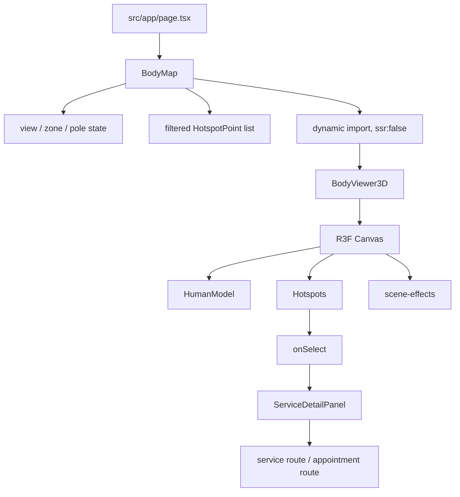

# BodyViewer3D Architecture and Redesign Guide

## Purpose

The body experience is an interactive service selector. It maps treatment services to body locations, lets the visitor filter those locations, and opens a service detail panel when a marker is selected.

The current implementation combines:

- a Three.js anatomical model;
- animated hotspot markers;
- camera parallax and scanner effects;
- a desktop detail panel;
- a mobile bottom sheet;
- front/back and zone/pole filters;
- French/Arabic labels;
- keyboard navigation.

The visual system is intentionally "holographic" and has many simultaneous animations. The safest redesign is to preserve the data and interaction contract while replacing the scene effects and panel transitions independently.

## File Map

| File | Responsibility |
| --- | --- |
| `src/components/sections/BodyMap.tsx` | Owns page state, filters, selection, detail panel, mobile sheet, and dynamic import of the 3D viewer. |
| `src/components/sections/body3d/BodyViewer3D.tsx` | Owns the R3F `Canvas`, WebGL setup, loading state, tooltip overlay, quality mode, and scene composition. |
| `src/components/sections/body3d/AnatomicalModel.tsx` | Loads the GLB, applies the skin material, builds the hologram shell, and rotates the model. |
| `src/components/sections/body3d/Hotspots.tsx` | Renders interactive markers and updates their animation every frame. |
| `src/components/sections/body3d/scene-effects.tsx` | Owns lights, environment, procedural backdrop, scanner, particles, floor shadow, and camera parallax. |
| `src/components/sections/body3d/zone.ts` | Defines body types, colors, model dimensions, and SVG-coordinate-to-3D-coordinate mapping. |
| `public/models/human-anatomy.glb` | The anatomical model loaded by `useGLTF`. |
| `src/data/services.ts` | Source of service metadata, prices, descriptions, FAQs, and pole membership. |

## Runtime Flow



### 1. Page entry

`src/app/page.tsx` renders `<BodyMap />` between the hero and services sections.

### 2. WebGL boundary

`BodyMap.tsx` dynamically imports `BodyViewer3D` with `ssr: false`. This is important because WebGL and Three.js must not execute during server rendering. The loading fallback reserves an `aspect-[5/6]` rectangle to reduce layout shift.

### 3. Application state

`BodyMap` owns these state values:

- `view`: `front` or `back`.
- `selectedZone`: `all`, `torso`, `legs`, `arms`, or `back`.
- `selectedPole`: `all`, `kinesitherapie`, or `minceur`.
- `selection`: selected point, selected service, and current detail tab.
- `hoveredSlug`: the currently hovered service marker.

The filtered marker list is calculated from `POINTS_BY_VIEW[view]`. The service lookup is a memoized `Map<string, Service>`.

### 4. Viewer props

`BodyViewer3D` is deliberately a controlled component. It does not own service selection. Its important props are:

```ts
interface BodyViewer3DProps {
  view: ViewSide;
  points: HotspotPoint[];
  serviceBySlug: Map<string, Service>;
  selectionSlug: string | null;
  hoveredSlug: string | null;
  onSelect: (point: HotspotPoint) => void;
  onHoverChange: (slug: string | null) => void;
  reduced: boolean;
  lang: 'fr' | 'ar';
  ariaLabel: string;
  onKeyDown?: (event: React.KeyboardEvent) => void;
}
```

A new renderer should keep this contract initially. That allows a visual replacement without rewriting filters and service detail logic.

## Current Scene Composition

The Canvas currently contains this stack:

1. `color` background: dark navy/black.
2. `StudioBackdrop`: custom gradient shader plane.
3. `SceneLights`: ambient, directional, spot, point, and procedural environment lights.
4. `GlassBackdrop`: physical material plane behind the model.
5. `HumanModel`: GLB plus a second transparent hologram shell.
6. `Hotspots`: one marker group for each filtered point.
7. `FloorShadow`: Drei `ContactShadows`.
8. `Scanner`: transparent animated shader plane.
9. `Particles`: 90 Drei sparkles.
10. `CameraRig`: pointer-based camera movement and idle motion.
11. `EffectComposer`: SSAO and Bloom on non-reduced desktop mode.

This is visually expensive because several effects are animated every frame and postprocessing requires additional render passes.

## Animation Inventory

### Model animation

`AnatomicalModel.tsx` uses `useFrame` to:

- interpolate the group toward front/back rotation;
- add continuous body sway;
- add a small Z-axis tilt;
- update the hologram shader time uniform;
- scale the hologram shell vertically in a breathing loop.

### Hotspot animation

Every hotspot has its own `useFrame` callback. It:

- copies the camera quaternion so rings face the camera;
- pulses the marker scale;
- changes the core color on hover/selection;
- updates halo opacity;
- expands two sonar rings;
- creates a point light for the active hotspot.

There are currently multiple per-frame callbacks for the model, camera, scanner, and every marker.

### DOM animation

`BodyMap.tsx` also uses Framer Motion for:

- section header reveal;
- control row reveal;
- canvas panel entrance;
- front/back 3D card transition;
- detail panel transitions;
- mobile bottom sheet slide-up;
- tab content transitions;
- decorative rotating icon.

This means the WebGL scene and the surrounding UI animate at the same time. The result is visually busy and can make interaction feel less deliberate.

## Interaction Contract

### Selecting a marker

1. A pointer enters a marker.
2. `Hotspots` calls `onHoverChange(slug)` and `onTooltip(point, x, y)`.
3. A click calls `onSelect(point)`.
4. `BodyMap.handlePointSelect` finds the service by slug.
5. `selection` is updated and the overview tab is selected unless the same service was already open.
6. Desktop renders `ServiceDetailPanel` beside the viewer.
7. Mobile renders `MobileBottomSheet` at the bottom of the viewport.

### Changing filters

Changing view, zone, or pole recalculates `currentPoints`. Changing the view also clears the current selection. The viewer receives a new point list and rerenders markers.

### Keyboard navigation

The viewer wrapper is focusable with `tabIndex={0}`. Arrow keys are handled by `BodyMap.handleSvgKeyDown`, despite the historical name referring to an SVG. Navigation cycles through the currently filtered points.

### Reduced motion

`useReducedMotion()` is read in `BodyMap` and passed as `reduced`.

Reduced mode currently:

- disables model sway;
- disables scanner, particles, and camera rig;
- disables postprocessing;
- makes the model snap to its target rotation;
- keeps the Canvas in `frameloop="demand"` mode.

A redesign must retain this behavior or improve it.

## Data Model

The 3D layer does not contain treatment data. It receives lightweight point data:

```ts
interface HotspotPoint {
  serviceSlug: string;
  cx: number;
  cy: number;
  zone: BodyZone;
  label: { fr: string; ar: string };
}
```

`cx` and `cy` are legacy 2D silhouette coordinates. `pointToWorld()` converts them to model coordinates using:

```ts
x = ((cx - 50) / 50) * MODEL.halfWidth
y = ((116 - cy) / 116) * MODEL.height
z = MODEL.frontDepth
```

The model constants are only correct for the current GLB scale and pose. If you replace the GLB, recalibrate `MODEL.height`, `MODEL.halfWidth`, and `MODEL.frontDepth`, then test every marker in both views.

## Why the Current UI Feels Bad

The main causes are structural:

1. Too many simultaneous motion systems: DOM reveals, card transitions, camera movement, marker pulses, scanner, particles, hologram breathing, Bloom, and SSAO.
2. The detail panel is visually dense and changes through several animated layers.
3. Hotspots use tiny visual cores with large invisible hit spheres, so the interaction target and visible affordance do not match.
4. Hover tooltip positioning uses Three pointer offsets and an HTML overlay, which can feel detached from the marker.
5. The viewer is presented as a decorative card, while the user task is service discovery.
6. The front/back transition is a CSS 3D card animation around a continuously animated WebGL model, creating competing motion cues.
7. The model, controls, and detail panel use different visual languages.
8. A point light is created for the selected marker, adding lighting complexity for a small UI signal.

## Recommended Redesign Direction

Use the 3D model as a calm spatial reference, not as the primary animation surface.

### Recommended visual hierarchy

1. Treatment selector and filters.
2. Clear selected body region.
3. One stable model view.
4. One restrained selection highlight.
5. Service details in a predictable panel.

### First-pass simplification

Keep:

- the GLB model;
- front/back view;
- filters;
- marker selection;
- keyboard navigation;
- bilingual labels;
- service detail panel;
- dynamic import and reduced-motion support.

Remove or disable first:

- `CameraRig` idle movement;
- `Particles`;
- `Scanner`;
- hologram shell breathing;
- per-hotspot sonar rings;
- per-hotspot point lights;
- SSAO;
- Bloom;
- animated front/back card rotation;
- automatic DOM reveal animations in this section.

This produces a stable baseline. Add back one effect at a time only when it improves comprehension.

## Suggested Target Architecture

### Option A: Stable 3D viewer with HTML marker layer

Use Three.js only for the model. Render markers as absolutely positioned HTML buttons using projected 3D coordinates or a 2D body map overlay.

Benefits:

- better accessibility;
- easier hover, focus, and tooltip styling;
- no invisible Three hit spheres;
- easier responsive layout;
- simpler keyboard navigation;
- less per-frame work.

Use this when the markers are UI controls rather than part of the anatomical visualization.

### Option B: 2D anatomical selector

Replace the GLB with an optimized SVG or illustrated body map and keep the current service and selection logic.

Benefits:

- much lower bundle and runtime cost;
- predictable mobile behavior;
- easy accessibility;
- no WebGL warnings;
- simpler testing.

Use this when service discovery matters more than 3D presentation.

### Option C: Focused 3D experience

Keep WebGL, but make the scene state-driven:

```ts
type ViewerMode = 'idle' | 'hovered' | 'selected' | 'transitioning';
```

Only the selected region animates. The rest of the model stays still. Camera movement should happen only during an explicit user drag or front/back transition.

## Safer Refactoring Sequence

### Step 1: Freeze the public contract

Do not change `BodyViewer3DProps`. Replace the internals while `BodyMap` continues to own state.

### Step 2: Make a static scene

In `BodyViewer3D.tsx`:

- keep the Canvas;
- keep `HumanModel`;
- remove `EffectComposer`;
- remove `Particles`, `Scanner`, and `CameraRig`;
- keep one ambient light and two directional lights;
- keep `frameloop="demand"` when no animation is active.

### Step 3: Simplify the model

In `AnatomicalModel.tsx`:

- keep one material;
- remove the merged hologram shell;
- rotate only on `view` changes;
- dispose cloned geometry/materials if you later create them dynamically;
- verify the GLB license and production file size.

### Step 4: Simplify markers

In `Hotspots.tsx`:

- use one marker mesh and one material;
- remove sonar rings;
- remove point lights;
- use a single selected color and scale state;
- consider moving marker controls to HTML.

### Step 5: Redesign the panel separately

In `BodyMap.tsx`:

- replace the multi-layer spring transitions with one opacity/translate transition;
- make the selected service title and booking action visually dominant;
- keep tabs only if each tab contains substantial information;
- on mobile, use a normal expandable panel before introducing a draggable sheet.

### Step 6: Add motion intentionally

Choose no more than:

- one view transition;
- one selected-marker emphasis;
- one panel transition.

Every animation should communicate a state change. Ambient motion should not run continuously by default.

## Performance Checklist

- Keep `ssr: false` for the WebGL viewer.
- Keep the aspect-ratio fallback to prevent layout shift.
- Prefer `dpr={[1, 1.5]}` on mobile and low-power devices.
- Avoid `EffectComposer` unless profiling proves it is worth the cost.
- Avoid `MeshTransmissionMaterial` for UI backgrounds.
- Avoid `useFrame` in every marker; centralize animation if markers need motion.
- Avoid `Math.random()` during render for deterministic hydration.
- Do not create new `THREE.Color` objects inside `useFrame`.
- Reuse materials, geometries, colors, and vectors.
- Use `dispose={null}` only when Drei owns the GLTF cache and you understand the lifecycle.
- Profile with Chrome Performance and the WebGL renderer info before adding effects.
- Test keyboard, touch, reduced motion, Arabic RTL, and low-end mobile devices.

## Accessibility Checklist

- Use a real `button` for each selectable hotspot where possible.
- Give each marker an accessible name such as `Radiofrequence - Hanches et taille`.
- Use `aria-pressed` for selection state.
- Keep focus visible.
- Do not rely on hover-only tooltips.
- Make selected service details available without a pointer.
- Keep arrow-key navigation and add Home/End support if useful.
- Announce selection changes with a small `aria-live="polite"` region.
- Ensure the model has a useful label, but do not expose decorative WebGL elements as separate accessible content.

## Known Technical Notes

### Three.js Clock warning

The current `THREE.Clock` deprecation warning is created internally by the installed `@react-three/fiber` package when it creates its renderer store. It is not created by `BodyViewer3D.tsx` or the scene components. Do not patch `node_modules` or replace the clock object manually. Upgrade R3F when a release exposes a supported `THREE.Timer` implementation.

### Shadow warning

The renderer shadow map is disabled in `BodyViewer3D.tsx`. The scene still has a separate Drei `ContactShadows` effect, which is independent from the renderer shadow map. If the warning remains after a clean dev-server restart, remove `ContactShadows` as well and use a transparent soft-gradient plane instead.

### GLTF material mutation

`HumanModel` mutates materials on the cached GLTF scene. This is acceptable while there is one viewer, but becomes risky if multiple viewers use different materials. Clone the scene or material resources before supporting multiple independent viewers.

### Shared shader uniforms

`HOLO_UNIFORMS` is module-level state. Multiple `HumanModel` instances would share animation time. Move uniforms inside the component or clone the uniform values if multiple viewers are ever mounted.

### Random hotspot seeds

`Hotspots.tsx` uses `Math.random()` in `useMemo` for marker phase offsets. Replace it with a deterministic hash of `serviceSlug` if hydration or reproducible visual tests become important.

## Verification Plan for a Redesign

1. Run TypeScript diagnostics.
2. Start the dev server with a clean `.next` cache.
3. Open the home page and confirm the viewer loads after the dynamic fallback.
4. Test front/back switching.
5. Test every zone and pole filter.
6. Select a marker on desktop and mobile.
7. Test Escape, arrow keys, and focus visibility.
8. Test French and Arabic, including RTL layout.
9. Enable `prefers-reduced-motion`.
10. Check Chrome console for Three.js warnings.
11. Record a Performance trace while idle and while selecting a marker.
12. Compare frame rate, interaction latency, and JS transfer size before and after.

## Minimal Stable Scene Example

This is the intended shape for the first redesign pass:

```tsx
<Canvas
  dpr={lowQuality ? [1, 1.25] : [1, 1.5]}
  camera={{ position: [0, 0.92, 3.1], fov: 38, near: 0.1, far: 30 }}
  gl={{ antialias: true, alpha: false, powerPreference: 'high-performance' }}
  frameloop={reduced || !hasActiveAnimation ? 'demand' : 'always'}
>
  <color attach="background" args={[colors.background]} />
  <ambientLight intensity={0.7} />
  <directionalLight position={[2, 3, 2]} intensity={1.1} />
  <HumanModel view={view} reduced={reduced} />
  <Hotspots {...markerProps} reduced={reduced} />
</Canvas>
```

The important change is not the exact numbers. It is the separation of responsibilities: stable scene, explicit state, restrained motion, and accessible UI controls.
