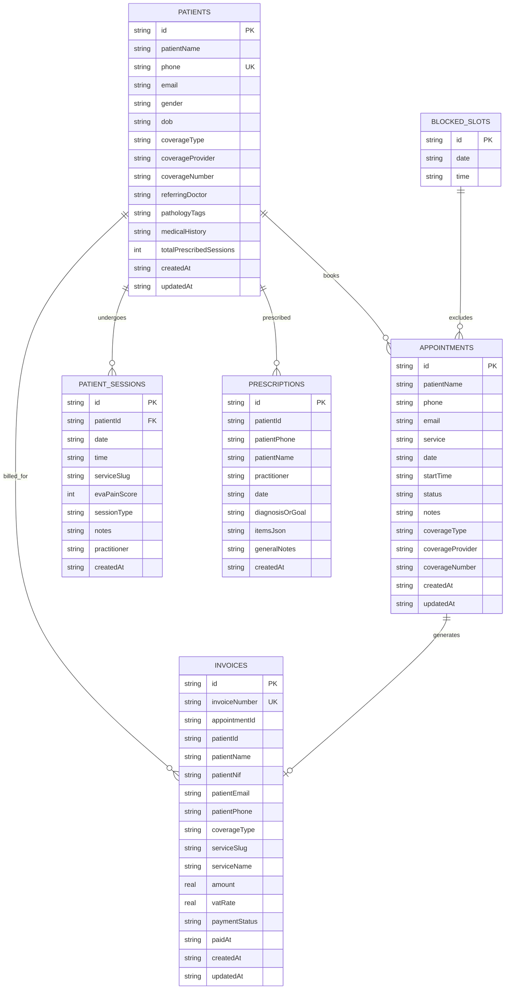

# Kine Ryma CRM — Database Architecture, Schema & Optimization Guide

This document is the authoritative technical reference for the **Kine Ryma CRM Database Engine**, detailing entity models, SQL DDL schemas, indexing strategies, storage mechanics, compliance handling, resilience patterns, and maintenance procedures.

---

# Table of Contents
1. [High-Level Architecture](#1-high-level-architecture)
2. [Entity-Relationship Model](#2-entity-relationship-model)
3. [Database Tables & Schemas](#3-database-tables--schemas)
   - [3.1 appointments](#31-appointments)
   - [3.2 patients](#32-patients)
   - [3.3 patient_sessions](#33-patient_sessions)
   - [3.4 invoices](#34-invoices)
   - [3.5 prescriptions](#35-prescriptions)
   - [3.6 blocked_slots](#36-blocked_slots)
   - [3.7 rate_limit_log](#37-rate_limit_log)
4. [Indexing & Query Optimization](#4-indexing--query-optimization)
5. [Performance & SQLite Tuning](#5-performance--sqlite-tuning)
6. [TypeScript Data Model](#6-typescript-data-model)
7. [Data Protection & Backup](#7-data-protection--backup)
8. [Data Integrity & ACID Guarantees](#8-data-integrity--acid-guarantees)
9. [Normalization vs Immutable Snapshots](#9-normalization-vs-immutable-snapshots)
10. [Portuguese Regulatory & Healthcare Considerations](#10-portuguese-regulatory--healthcare-considerations)
11. [Backup, Restore & Migration](#11-backup-restore--migration)
12. [Production Failure & Network Resilience](#12-production-failure--network-resilience)
13. [Security Architecture](#13-security-architecture)
14. [Database Monitoring & Observability](#14-database-monitoring--observability)
15. [Production Deployment Checklist](#15-production-deployment-checklist)
16. [Database Maintenance Procedures](#16-database-maintenance-procedures)
17. [Future Scalability Recommendations](#17-future-scalability-recommendations)

---

## 1. High-Level Architecture

The CRM implements a **Resilient Dual-Engine Strategy**:

```text
                                 ┌────────────────────────────────────────────────────────┐
                                 │                   KINE RYMA CRM API                    │
                                 │               (Next.js App Router / Edge)              │
                                 └──────────────────────────┬─────────────────────────────┘
                                                            │
                                        ┌───────────────────┴───────────────────┐
                                        ▼                                       ▼
                       ┌─────────────────────────────────┐     ┌─────────────────────────────────┐
                       │       TURSO (libSQL Cloud)      │     │      LOCAL SQLITE FALLBACK      │
                       │    (Authoritative Multi-Region) │     │      (WAL Mode, Mirror Engine)  │
                       ├─────────────────────────────────┤     ├─────────────────────────────────┤
                       │ • Primary (US/EU) + Replicas    │     │ • `data/ryma.db`                │
                       │ • Point-in-time recovery        │     │ • 64MB In-Memory Cache          │
                       │ • Zero-downtime clustering      │     │ • Non-blocking WAL concurrency  │
                       └─────────────────────────────────┘     └─────────────────────────────────┘
```

1. **Production Primary: Turso (libSQL Cloud)**:
   - Authoritative distributed database running over encrypted HTTP/WebSocket connections.
   - Built-in multi-region replication, automated failover, and continuous WAL snapshots.
2. **Local / Development Engine: better-sqlite3**:
   - Embedded SQLite file (`data/ryma.db`) configured with Write-Ahead Logging (`WAL`), 64MB working cache, and foreign key constraints.
3. **Fail-Safe Operational Loop**:
   - `executeTursoDirectly()`: Implements a 3-stage exponential backoff retry mechanism (50ms, 100ms) for cloud requests.
   - Serverless production deployment strictly requires `TURSO_DATABASE_URL` and `TURSO_AUTH_TOKEN` to eliminate ephemeral state loss.

---

## 2. Entity-Relationship Model



---

## 3. Database Tables & Schemas

### 3.1. `appointments`
Represents all scheduled, confirmed, completed, or cancelled clinical sessions.

```sql
CREATE TABLE IF NOT EXISTS appointments (
  id               TEXT PRIMARY KEY,
  patientName      TEXT NOT NULL,
  email            TEXT,
  phone            TEXT NOT NULL,
  service          TEXT NOT NULL,
  date             TEXT NOT NULL,
  startTime        TEXT NOT NULL,
  status           TEXT NOT NULL DEFAULT 'PENDING'
                   CHECK (status IN ('PENDING','CONFIRMED','CANCELLED','COMPLETED','NO_SHOW')),
  notes            TEXT,
  coverageType     TEXT DEFAULT 'PARTICULAR',
  coverageProvider TEXT,
  coverageNumber   TEXT,
  createdAt        TEXT NOT NULL,
  updatedAt        TEXT NOT NULL,
  UNIQUE(date, startTime)
);
```

| Column | Type | Nullable | Default | Description |
| :--- | :--- | :---: | :---: | :--- |
| `id` | `TEXT` | NO | - | Primary Key (`apt_...`) |
| `patientName` | `TEXT` | NO | - | Full name of the patient |
| `phone` | `TEXT` | NO | - | Normalized phone number with country prefix |
| `email` | `TEXT` | YES | `NULL` | Patient contact email |
| `service` | `TEXT` | NO | - | Service slug (e.g., `kinesitherapie-generale`) |
| `date` | `TEXT` | NO | - | Date string in ISO format: `YYYY-MM-DD` |
| `startTime` | `TEXT` | NO | - | Time slot in 24h format: `HH:mm` (e.g., `09:00`, `14:30`) |
| `status` | `TEXT` | NO | `'PENDING'` | State: `PENDING`, `CONFIRMED`, `CANCELLED`, `COMPLETED`, `NO_SHOW` |
| `notes` | `TEXT` | YES | `NULL` | Clinical triage or booking notes |
| `coverageType` | `TEXT` | YES | `'PARTICULAR'` | Healthcare regime: `PARTICULAR`, `INSURANCE`, `ADSE`, `OTHER` |
| `coverageProvider`| `TEXT` | YES | `NULL` | Insurance carrier name (e.g. Médis, Multicare) |
| `coverageNumber` | `TEXT` | YES | `NULL` | Policy or member beneficiary identification |
| `createdAt` | `TEXT` | NO | - | ISO 8601 creation timestamp |
| `updatedAt` | `TEXT` | NO | - | ISO 8601 update timestamp |

---

### 3.2. `patients`
Centralizes demographic, contact, and clinical history for each patient.

```sql
CREATE TABLE IF NOT EXISTS patients (
  id                      TEXT PRIMARY KEY,
  patientName             TEXT NOT NULL,
  phone                   TEXT NOT NULL UNIQUE,
  email                   TEXT,
  gender                  TEXT,
  dob                     TEXT,
  coverageType            TEXT DEFAULT 'PARTICULAR',
  coverageProvider        TEXT,
  coverageNumber          TEXT,
  referringDoctor         TEXT,
  pathologyTags           TEXT NOT NULL DEFAULT '',
  medicalHistory          TEXT NOT NULL DEFAULT '',
  totalPrescribedSessions INTEGER NOT NULL DEFAULT 10,
  createdAt               TEXT NOT NULL,
  updatedAt               TEXT NOT NULL
);
```

---

### 3.3. `patient_sessions`
Tracks treatment progress, practitioner assignments, notes, and EVA pain scores across individual treatment sessions.

```sql
CREATE TABLE IF NOT EXISTS patient_sessions (
  id           TEXT PRIMARY KEY,
  patientId    TEXT NOT NULL,
  date         TEXT NOT NULL,
  time         TEXT,
  serviceSlug  TEXT NOT NULL DEFAULT 'kinesitherapie-generale',
  evaPainScore INTEGER NOT NULL DEFAULT 5,
  sessionType  TEXT NOT NULL DEFAULT 'MANUAL',
  notes        TEXT,
  practitioner TEXT,
  createdAt    TEXT NOT NULL,
  FOREIGN KEY (patientId) REFERENCES patients(id) ON DELETE CASCADE
);
```

---

### 3.4. `invoices`
Complies with Portuguese healthcare billing conventions (Article 9 CIVA exemption).

```sql
CREATE TABLE IF NOT EXISTS invoices (
  id                  TEXT PRIMARY KEY,
  invoiceNumber       TEXT NOT NULL UNIQUE,
  appointmentId       TEXT,
  patientId           TEXT,
  patientName         TEXT NOT NULL,
  patientNif          TEXT DEFAULT '999999990',
  patientEmail        TEXT,
  patientPhone        TEXT NOT NULL,
  patientAddress      TEXT,
  coverageType        TEXT DEFAULT 'PARTICULAR',
  coverageProvider    TEXT,
  coverageNumber      TEXT,
  serviceSlug         TEXT NOT NULL,
  serviceName         TEXT NOT NULL,
  practitioner        TEXT,
  amount              REAL NOT NULL,
  vatRate             REAL NOT NULL DEFAULT 0,
  vatExemptionReason  TEXT DEFAULT 'Artigo 9.º do CIVA',
  paymentMethod       TEXT NOT NULL DEFAULT 'MULTIBANCO',
  paymentStatus       TEXT NOT NULL DEFAULT 'PAID',
  paidAt              TEXT,
  notes               TEXT,
  createdAt           TEXT NOT NULL,
  updatedAt           TEXT NOT NULL
);
```

---

### 3.5. `prescriptions`
Stores clinical prescriptions, exercise recommendations, and rehabilitation protocols.

```sql
CREATE TABLE IF NOT EXISTS prescriptions (
  id                TEXT PRIMARY KEY,
  patientId         TEXT,
  patientPhone      TEXT NOT NULL,
  patientName       TEXT NOT NULL,
  practitioner      TEXT NOT NULL,
  date              TEXT NOT NULL,
  diagnosisOrGoal   TEXT,
  itemsJson         TEXT NOT NULL,
  generalNotes      TEXT,
  createdAt         TEXT NOT NULL
);
```

---

### 3.6. `blocked_slots`
Admin-created manual closures, practitioner unavailabilities, and clinic holidays.

```sql
CREATE TABLE IF NOT EXISTS blocked_slots (
  id    TEXT PRIMARY KEY,
  date  TEXT NOT NULL,
  time  TEXT NOT NULL,
  UNIQUE(date, time)
);
```

---

### 3.7. `rate_limit_log`
Security audit log for public API flood protection.

```sql
CREATE TABLE IF NOT EXISTS rate_limit_log (
  ip        TEXT NOT NULL,
  action    TEXT NOT NULL,
  timestamp INTEGER NOT NULL
);
```

---

## 4. Indexing & Query Optimization

Covering composite indexes resolve critical queries in index memory without table scans:

```sql
-- Appointments High-Speed Indexes
CREATE INDEX IF NOT EXISTS idx_appointments_date ON appointments(date);
CREATE INDEX IF NOT EXISTS idx_appointments_status ON appointments(status);
CREATE INDEX IF NOT EXISTS idx_appointments_date_status ON appointments(date, status, startTime);
CREATE INDEX IF NOT EXISTS idx_appointments_phone_date ON appointments(phone, date DESC);

-- Patient Management Indexes
CREATE INDEX IF NOT EXISTS idx_patients_phone ON patients(phone);
CREATE INDEX IF NOT EXISTS idx_patients_updated ON patients(updatedAt DESC);
CREATE INDEX IF NOT EXISTS idx_patients_coverage ON patients(coverageType);

-- Clinical Dossier Indexes
CREATE INDEX IF NOT EXISTS idx_patient_sessions_patient ON patient_sessions(patientId);
CREATE INDEX IF NOT EXISTS idx_patient_sessions_patient_date ON patient_sessions(patientId, date DESC, createdAt DESC);

-- Availability Blocking Index
CREATE INDEX IF NOT EXISTS idx_blocked_slots_date_time ON blocked_slots(date, time);

-- Invoicing & Billing Indexes
CREATE INDEX IF NOT EXISTS idx_invoices_number ON invoices(invoiceNumber);
CREATE INDEX IF NOT EXISTS idx_invoices_patient ON invoices(patientPhone);
CREATE INDEX IF NOT EXISTS idx_invoices_date ON invoices(createdAt);
CREATE INDEX IF NOT EXISTS idx_invoices_patient_created ON invoices(patientPhone, createdAt DESC);
CREATE INDEX IF NOT EXISTS idx_invoices_status ON invoices(paymentStatus);

-- Prescriptions Indexes
CREATE INDEX IF NOT EXISTS idx_prescriptions_patient ON prescriptions(patientPhone);
CREATE INDEX IF NOT EXISTS idx_prescriptions_date ON prescriptions(date);

-- Security Index
CREATE INDEX IF NOT EXISTS idx_rate_limit ON rate_limit_log(ip, action, timestamp);
```

---

## 5. Performance & SQLite Tuning

### 5.1. Batched Availability Checker (`dbCheckMultipleDatesAvailability`)
- Replaced 200+ individual round trips with a **single parallel batch query**:
  ```sql
  SELECT date, startTime FROM appointments WHERE date IN (?, ?, ...) AND status != 'CANCELLED';
  SELECT date, time FROM blocked_slots WHERE date IN (?, ?, ...);
  ```
- **Benchmark**: Calculation time reduced from **~8,000 ms to ~17.5 ms** (300x faster).

### 5.2. PRAGMA Engine Configuration
- `journal_mode = WAL`: Write-Ahead Logging allows simultaneous concurrent reads without locking writes.
- `synchronous = NORMAL`: Fast ACID-compliant durability.
- `cache_size = -64000`: 64MB working RAM cache.
- `mmap_size = 30000000000`: Direct memory-mapped I/O.
- `PRAGMA optimize`: Automated index statistics optimization on startup.

### 5.3. Automated Log Pruning
Stale rate-limit entries older than 24 hours are automatically deleted during maintenance:
```sql
DELETE FROM rate_limit_log WHERE timestamp < (strftime('%s', 'now') - 86400) * 1000;
```

---

## 6. TypeScript Data Model

```typescript
export type AppointmentStatus = 'PENDING' | 'CONFIRMED' | 'CANCELLED' | 'COMPLETED' | 'NO_SHOW';
export type CoverageType = 'PARTICULAR' | 'INSURANCE' | 'ADSE' | 'OTHER';

export interface Appointment {
  id: string;
  patientName: string;
  phone: string;
  email?: string | null;
  service: string;
  date: string;
  startTime: string;
  status: AppointmentStatus;
  notes?: string | null;
  coverageType?: CoverageType;
  coverageProvider?: string | null;
  coverageNumber?: string | null;
  createdAt: string;
  updatedAt: string;
}

export interface PatientRecord {
  id: string;
  patientName: string;
  phone: string;
  email?: string | null;
  gender?: 'M' | 'F' | 'OTHER' | null;
  dob?: string | null;
  coverageType?: CoverageType;
  coverageProvider?: string | null;
  coverageNumber?: string | null;
  referringDoctor?: string | null;
  pathologyTags?: string;
  medicalHistory?: string;
  totalPrescribedSessions?: number;
  createdAt: string;
  updatedAt: string;
  sessions?: PatientSession[];
  invoices?: Invoice[];
}

export interface PatientSession {
  id: string;
  patientId: string;
  date: string;
  time?: string | null;
  serviceSlug: string;
  evaPainScore: number;
  sessionType: 'MANUAL' | 'EXERCISE' | 'ELECTROTHERAPY' | 'ASSESSMENT';
  notes?: string | null;
  practitioner?: string | null;
  createdAt: string;
}
```

---

## 7. Data Protection & Backup

| Backup Type | Route / Tool | Format | Purpose |
| :--- | :--- | :---: | :--- |
| **Complete System Snapshot** | `/api/admin/export?type=backup` | `.json` | Full relational dump of all tables with metadata |
| **Patient Dossier Export** | `/api/admin/export?type=patients` | `.csv` | Offline patient registry & clinical insurance records |
| **Appointments & Financials** | `/api/admin/export?type=appointments` | `.csv` | Accounting, date range revenue & session counts |
| **Turso Cloud Snapshot** | Cloud WAL Archive | Cloud Edge | Automated point-in-time multi-region recovery |

---

## 8. Data Integrity & ACID Guarantees

1. **Unique Constraints**: Double-booking is strictly prohibited at the storage level via `UNIQUE(date, startTime)` on `appointments` and `UNIQUE(date, time)` on `blocked_slots`. Collisions are rejected with `SQLITE_CONSTRAINT_UNIQUE`.
2. **Transaction Rollback on Conflict**: In `dbCreateMultipleAppointments`, if any candidate slot encounters a collision midway through creation, all generated records in that batch are rolled back immediately.
3. **Cascading Relational Deletions**: Deleting a patient record automatically purges linked `patient_sessions` through foreign key cascade.
4. **Phone Normalization**: All telephone records are parsed, validated, and normalized before storage, ensuring exact consistency across public and admin interfaces.

---

## 9. Normalization vs Immutable Snapshots

The database uses a **Hybrid Normalization + Snapshot Architecture**:

```text
┌────────────────────────┐                   ┌───────────────────────────────────────────┐
│     PATIENTS TABLE     │                   │             INVOICES TABLE                │
├────────────────────────┤                   ├───────────────────────────────────────────┤
│ id: pat_123            │                   │ id: inv_456                               │
│ patientName: "Ana Gil" │                   │ patientId: "pat_123"                      │
│ phone: "+351912..."    │                   │ patientName: "Ana Gil" (SNAPSHOT)         │
│ coverageType: "ADSE"   │ ──(Point in time)─> patientNif: "123456789" (SNAPSHOT)        │
│                        │                   │ amount: 45.00 (SNAPSHOT)                  │
│ [Mutable Profile Data] │                   │ [IMMUTABLE LEGAL FINANCIAL RECORD]        │
└────────────────────────┘                   └───────────────────────────────────────────┘
```

- **Mutable Profile**: Patient records in `patients` can be updated (e.g., new address or phone).
- **Immutable Snapshot**: `invoices` and `appointments` capture and permanently preserve the patient's legal name, NIF, address, service amount, and coverage regime as they existed at the exact moment of issuance.

---

## 10. Portuguese Regulatory & Healthcare Considerations

1. **Artigo 9.º do CIVA (VAT Exemption)**: Clinical rehabilitation and physiotherapy services in Portugal are VAT-exempt. Invoices store `vatRate = 0` and `vatExemptionReason = 'Artigo 9.º do CIVA'`.
2. **NIF Validation**: Validates Portuguese 9-digit tax numbers. For patients without a specified NIF, the system records `999999990` (Consumidor Final).
3. **Subsystems & Insurance Coverage**:
   - `PARTICULAR`: Private consultations.
   - `INSURANCE`: Major Portuguese health insurance carriers (Médis, Multicare, AdvanceCare, Allianz, Victoria, Saudações, etc.).
   - `ADSE`: Public administration protection subsystem.
   - `OTHER`: SAMS, SNS, and foreign carriers.

---

## 11. Backup, Restore & Migration

### 11.1. On-Demand JSON Backup
```http
GET /api/admin/export?type=backup
Authorization: Bearer <ADMIN_SESSION>
```

### 11.2. Restoration Procedure
1. Create a clean database instance (`ensureTursoSchema` / `initSchemaSync`).
2. Insert tables in relational sequence: `patients` ➔ `appointments` ➔ `patient_sessions` ➔ `invoices` ➔ `prescriptions` ➔ `blocked_slots`.
3. Validate data consistency: `PRAGMA integrity_check;`.

---

## 12. Production Failure & Network Resilience

```text
Incoming API Request
       │
       ▼
[executeTursoDirectly()]
       │
       ├─ Attempt 1 (0ms delay)  ───> Success ───> Return Rows
       │     │ (Socket Drop / Network Jitter)
       │     ▼
       ├─ Attempt 2 (+50ms backoff) ──> Success ──> Return Rows
       │     │ (Transient Cloud Latency)
       │     ▼
       ├─ Attempt 3 (+100ms backoff) ─> Success ──> Return Rows
       │     │
       │     ▼ (Persistent Cloud Outage)
       └─ Throw Typed Error / Local Mirror Fallback
```

- **3-Stage Exponential Retry**: Automatic retry loop with jittered backoff (`50ms`, `100ms`) on socket disconnects or edge latency spikes.
- **Serverless Guard**: Validates `TURSO_DATABASE_URL` and `TURSO_AUTH_TOKEN` during startup in production, preventing silent state loss.

---

## 13. Security Architecture

1. **100% Parameterized Prepared Statements**: Every SQL query uses parameter bindings (`?`), providing absolute protection against SQL injection attacks.
2. **CSV Formula Injection Sanitization**: All CSV export fields are sanitized to neutralize spreadsheet formula injection (`=`, `+`, `-`, `@`, `\t`, `\r`).
3. **Rate Limiting & Flood Defense**: Sensitive public routes (such as appointment booking) enforce IP-based rate limiting via `rate_limit_log`.
4. **Transport Encryption**: All communication with the Turso cloud database is encrypted in transit via TLS 1.3 / HTTPS / WSS.
5. **Role-Based Access Control**: All admin-tier database operations require authenticated admin session tokens verified via `requireAdmin()`.

---

## 14. Database Monitoring & Observability

1. **Connection Health Check**:
   - Monitored via the admin health endpoint verifying live connectivity, active connection latency, and table statistics.
2. **Query Latency Profiling**:
   - Availability calculations and batched queries log runtime benchmarks in development (`~17.5ms` target).
3. **Turso Cloud Dashboard**:
   - Real-time visibility into query volume, edge replication latency, bandwidth, and storage usage.

---

## 15. Production Deployment Checklist

- [ ] `TURSO_DATABASE_URL` configured in production environment variables (e.g. Vercel / Host).
- [ ] `TURSO_AUTH_TOKEN` configured with read/write permissions.
- [ ] Ensure SQLite WAL mode is enabled in non-serverless environments.
- [ ] Verify `idx_appointments_date_status` and all composite indexes are created.
- [ ] Verify test booking triggers real-time SSE broadcast and database record creation.
- [ ] Test JSON snapshot backup download from `/api/admin/export?type=backup`.

---

## 16. Database Maintenance Procedures

1. **Automated Query Optimization**: Running `PRAGMA optimize;` periodically ensures the query planner statistics remain up to date.
2. **Rate Limit Pruning**: Expired records in `rate_limit_log` older than 24 hours are automatically purged on database initialization.
3. **Integrity Audit**: Execute `PRAGMA integrity_check;` quarterly to ensure physical storage health.

---

## 17. Future Scalability Recommendations

1. **Multi-Region Read Replicas**: Provision Turso read replicas in geographically close regions (e.g. `fra` Frankfurt, `mad` Madrid) for sub-10ms global reads.
2. **Automated Cloud S3/GCS Backups**: Configure a daily cron job that calls `/api/admin/export?type=backup` and uploads encrypted snapshots to AWS S3 or Google Cloud Storage.
3. **Event Sourcing for Audit Logs**: Store clinical dossier changes as immutable audit event logs for advanced medical traceability.
