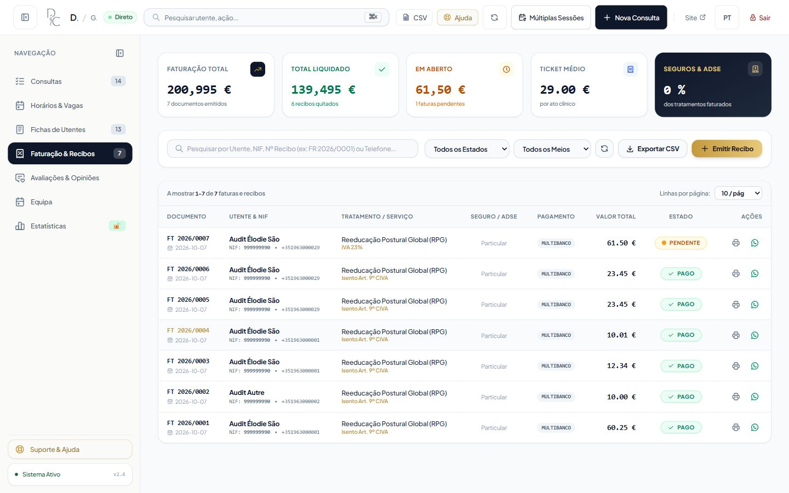

# Audit du dashboard Kine Ryma / Digital Clínica

> État initial historique. Le [ré-audit des 7–8 octobre 2026](reaudit/dashboard-reaudit.md) décrit les corrections implémentées pour QA-01 à QA-19, une correction supplémentaire QA-20, les tests passants et la validation navigateur encore bloquée. Le [premier lot](corrections/batch-01.md) reste conservé. Le présent rapport et ses preuves décrivent uniquement l'état initial audité.

**Date : 7 octobre 2026. Verdict : NON PRÊT pour une utilisation clinique et financière quotidienne en l'état.**

Audit du code présent dans le répertoire de travail, y compris ses modifications préexistantes ; ce rapport ne représente pas nécessairement la version déployée. Aucun correctif métier n'a été appliqué. Toutes les personnes et données reproduites ici sont fictives.

## A. Résumé exécutif

Le socle de réservation fonctionne dans les scénarios exécutés : authentification serveur, disponibilité commune au public et à l'administration, séries atomiques, conflits de durée et quatre courses concurrentes. La compilation de production réussit. Ces résultats ne suffisent pas à autoriser l'exploitation clinique : plusieurs actions ordinaires peuvent perdre ou masquer l'historique, attribuer un document à une identité incohérente ou produire une information médicale/financière trompeuse.

Les risques prioritaires sont la suppression physique de séances liées à un rendez-vous, la dépendance de l'historique au téléphone modifiable, la fusion silencieuse de deux personnes partageant un numéro, les séances futures comptées comme réalisées, l'écriture clinique partielle lors d'une erreur, les doubles factures et les fractions de centime. **19 fiches : 8 P1, 10 P2, 1 P3. Aucun P0 démontré.** L'absence de P0 observé ne constitue pas une garantie générale de sécurité.

Le verdict porte sur les usages dossier patient, suivi clinique, documents et facturation. Le moteur de réservation apporte des preuves favorables dans un environnement isolé ; il n'est pas certifié pour toute charge ou configuration de production. La suppression logique attendue, le rattachement explicite d'une séance à un rendez-vous existant et la traçabilité clinique ne sont pas implémentés comme demandés.

### Périmètre effectivement vérifié

| Vérification | Résultat et portée | Preuve |
|---|---|---|
| Build production Next.js | Réussi, compilation et TypeScript, 24 routes pré-rendues selon build | [build.log](evidence/build.log) |
| Suite existante SQLite | 124 tests déclarés par Node, 124 pass, 0 fail | [suite.log](evidence/suite.log) |
| Suite adaptateur libSQL local | 95 tests déclarés par Node, 95 pass, 0 fail | [libsql.log](evidence/libsql.log) |
| Script existant dashboard | 36 contrôles PASS | [dashboard.log](evidence/dashboard.log) |
| Scénarios HTTP supplémentaires | 34 scénarios : 22 PASS, 12 FAIL ; appels au véritable serveur compilé | [http-results.json](evidence/http-results.json) |
| Compléments HTTP | 10 observations brutes ; interprétation corrigée ci-dessous | [extra-results.json](evidence/extra-results.json) |
| Recalcul indépendant | 20 assertions : 17 PASS, 3 FAIL ; instantané final de la fixture | [metrics-verification.json](evidence/metrics-verification.json) |
| Navigateur | Parcours mobile, navigation semaine/année, plusieurs vues, responsive et modale | [ui-results.json](evidence/ui-results.json) et captures |
| Documents | 4 PDF produits, 7 pages rendues et inspectées ; extraction du texte | [pdf-inspection.json](evidence/pdf-inspection.json) |
| Volumétrie | 100 patients/500 RDV et 1 000/10 000, base SQLite locale dédiée | [performance.json](evidence/performance.json) |
| Dépendances | npm audit du lockfile de production : 5 paquets signalés | [dependencies-audit.json](evidence/dependencies-audit.json) |
| Préservation du dépôt | 202 fichiers source/données inchangés par rapport au manifeste initial | [source-preservation.json](evidence/source-preservation.json) |

Les suites se recouvrent ; leurs nombres ne s'additionnent pas en fonctionnalités distinctes. Certains tests appellent les handlers avec cookies, authentification ou transports simulés. Les 34 scénarios HTTP utilisent le serveur réel local. Aucun pourcentage de couverture n'est revendiqué.

### Limites et corrections de mesure

- Aucun accès à la production, aucune lecture des secrets .env, aucune modification de base réelle, aucun envoi réel email/SMS/WhatsApp. Les fichiers de données existants ont seulement été hachés pour vérifier leur conservation.
- Tests Windows locaux, SQLite et libSQL en fichier ; ni Turso distant, ni proxy/hébergement réel, ni politique de sauvegarde/restauration de l'exploitant validés.
- L'assertion PUBLIC-01 du complément HTTP était erronée : fetch suivait un 307 vers l'accueil et recevait 200. Vérification corrigée sans suivre la redirection : **aucun fichier privé exposé** sur les trois chemins contrôlés. [Preuve corrective](evidence/public-path-verification.json).
- AUTH-10 accepte un Origin étranger avec un cookie ajouté manuellement. Cela prouve l'absence de rejet explicite de cet Origin, **pas** un contournement de SameSite=Lax dans un navigateur. Le risque CSRF exploitable reste NOT TESTED.
- La première exécution du script dashboard avait une variable de fallback propre au harnais incompatible avec son test de configuration. Après correction du seul harnais, les 36 contrôles passent. Le téléchargement de polices avait initialement bloqué le build ; le build final a réussi après accès réseau autorisé. Ce ne sont pas des anomalies du produit.
- Excel natif : BLOCKED, aucune session Excel contrôlable disponible. Il faut ouvrir les CSV sur le poste cible et contrôler encodage, séparateurs et types. Le contenu CSV a été testé sans prétendre cette ouverture.
- Coupure réseau navigateur, réponses volontairement tardives, expiration pendant une saisie, deux onglets UI simultanés, lecteur d'écran, contraste mesuré et toutes les variantes de langue : NOT TESTED. L'expiration de 8 h est vérifiée par horloge/cookie simulés.
- Les templates PDF réels ont été imprimés par Chrome headless puis ouverts sous forme de pages rendues. Le dialogue système « enregistrer en PDF » du bouton UI n'a pas été piloté.
- Aucune conformité RGPD, certification fiscale, validité professionnelle ou conformité comptable portugaise n'est affirmée.

## B. Inventaire et couverture

### Environnement et architecture

Stack réellement installée : Next.js 16.3.4 App Router, React/React DOM 19.2.8, TypeScript 5, Tailwind 4, better-sqlite3 13.0.3 et @libsql/client 0.17.4, iron-session 8, bcryptjs 3, nodemailer 9.0.5. Les contraintes déclarées sont dans package.json, les versions résolues dans package-lock.json. Instructions AGENTS.md et guides Next embarqués pertinents lus avant intervention.

Copie de test : ../tmp/dashboard-audit-20261007/project, serveur compilé lié uniquement à 127.0.0.1:3117. Une nouvelle fixture.db a été créée, sans copie des données réelles. Les sources/scripts/public/configurations ont été copiés, node_modules partagé par junction ; aucun paquet n'a été installé ou mis à niveau. Secrets de session et identifiants synthétiques propres au harnais ; SMTP vide, WhatsApp désactivé ; les suites d'intégration utilisent des mocks. Scripts d'audit conservés dans [tools](tools).

Les principaux écrans sont /admin/login et /admin?tab=appointments, slots, patients, invoices, reviews, analytics, team. Il n'y a pas sept pages serveur indépendantes : le dashboard sélectionne ses onglets côté client. Les composants comprennent notamment AgendaContent et les vues agenda, AddAppointmentModal, AppointmentDetailModal, RescheduleAppointment, MultipleSessionsModal, PatientNotesTab, CreatePrescriptionModal, PrescriptionDetailModal, CreateInvoiceModal, InvoicesTab, AnalyticsTab, ReviewsTab, les panneaux équipe, OwnerAuthModal, ResponsiveModal, AdminCommandPalette et ClinicHelpdeskDrawer.

**32 fichiers API, 49 méthodes exportées, 38 méthodes protégées par requireAdmin/requireOwnerAnalytics.** Aucun Server Action « use server » trouvé. [Inventaire méthode par méthode](api-inventory.md), [matrice complète des fonctionnalités](feature-matrix.md), [483 sites JSX de contrôles interactifs](ui-controls.md). Le dernier registre donne fichier, ligne, cible et gestionnaire ; chaque contrôle sans preuve d'exécution individuelle exhaustive est explicitement NOT TESTED. Un site JSX répété dans une boucle n'est pas un nombre de boutons visibles ni une fonctionnalité distincte.

### Modèle de données et services

| Groupe | Tables découvertes dans la fixture principale | Contraintes / observations |
|---|---|---|
| Réservations | appointments, blocked_slots, booking_sync, idempotency_keys | Statut parmi 5 valeurs ; snapshots durée/buffers/ressources ; versions ; triggers anti-chevauchement et réservation/blocage |
| Équipe et capacité | practitioners, practitioner_services, working_hours, schedule_exceptions, resources, service_resources, schema_migrations | Horaires clinique/praticien, jours exceptionnels, capacités, spécialités ; migrations de scheduling |
| Patients | patients, patient_notes, patient_sessions | Téléphone unique sur patients ; notes legacy indexées par téléphone ; FK patient_sessions.patientId avec suppression cascade ; EVA sans CHECK métier suffisant |
| Documents | invoices, invoice_sequences, prescriptions | Montants REAL ; numérotation ; patientId/appointmentId de documents sans relation SQL complète garantissant l'identité |
| Sécurité | rate_limit_log, revoked_sessions, owner_step_up_grants, security_settings, security_audit_logs | Révocation serveur et grant propriétaire distinct du cookie ; journal de sécurité limité |
| Avis | reviews | Modération et affichage public |

23 tables, 52 index incluant les auto-index, 35 triggers dans cet instantané. Les tables de l'intégration WhatsApp sont initialisées dans ses fixtures dédiées et ne sont pas comptées ici. [DDL, index et triggers](evidence/schema.json). Mode WAL et busy_timeout 5 000 ms constatés. Les suites exercent contraintes SQL brutes, conflits transactionnels, rollback, retries et erreurs de verrouillage sur les deux adaptateurs locaux.

dbCheckSlotAvailability, booking-service et scheduling-engine sont partagés par les voies publique, admin, séries et séances planifiées ; les tests vérifient aussi les gardes SQL contre un écrivain contournant le service. Un chevauchement tient compte de la durée, des buffers, du praticien et des ressources, pas seulement de l'heure de début. La fixture par défaut ouvre lundi à samedi, 08:30–12:30 et 14:00–17:30, dimanche fermé ; ce sont des réglages, pas une interdiction universelle du dimanche.

Les endpoints sensibles retournent no-store ; le flux /api/admin/events utilise événement local et révision DB, scrutée environ toutes les 3 s, avec contrôles d'accès périodiques. La fermeture et la révocation du flux sont testées ; le rafraîchissement visuel de deux onglets reste à exécuter. Les chargements paginés coexistent avec des chemins historiques retournant tous les patients et toutes les notes. Les appels multiples d'une fiche peuvent charger séparément patient, historique, factures et prescriptions.

Intégrations découvertes : SMTP, Meta WhatsApp avec webhook/jobs, reCAPTCHA avec fallback, Turso/libSQL, polices externes et liens de contact. Aucun service SMS autonome découvert. Le fallback public sans token reCAPTCHA est explicite dans le code ; son efficacité anti-abus en déploiement réel n'est pas établie par cet audit.

### Légende des résultats

PASS : le scénario identifié possède une preuve adaptée. FAIL : écart reproduit, ou lacune démontrée par inspection explicitement qualifiée. BLOCKED : un moyen nécessaire manque. NOT TESTED : non exécuté, même si le code paraît favorable. NOT APPLICABLE : fonctionnalité absente ou non pertinente pour l'architecture découverte. Une observation d'absence de fonctionnalité peut également être un écart au besoin demandé ; c'est explicité dans la fiche concernée.

## C. Résultats par module

La [matrice détaillée](feature-matrix.md) fournit les neuf colonnes demandées : module, fonctionnalité, route/UI, API/action, tables, règle, méthode, résultat, preuve. Cette section détaille les parcours et les résultats qui déterminent le verdict.

### Authentification, autorisations et sécurité

Les 38 méthodes gardées renvoient 401 sans session, y compris accès patient, séances, factures, prescriptions et exports. La page sans cookie ou avec cookie forgé redirige 307. Login invalide 401, valide 200 ; cookie Secure, HttpOnly, SameSite=Lax, durée maximale 28 800 s. Dix mauvais mots de passe sont suivis d'un 429. La confiance aux en-têtes IP derrière le proxy de production reste à vérifier.

Un admin sans déverrouillage reçoit 403 sur analytics et les deux routes d'export contrôlées. Le propriétaire déverrouillé obtient 200. Le grant propriétaire est vérifié côté serveur ; les suites contrôlent verrouillage, rotation et révocation. Après logout, rejouer le cookie donne 401 sur /me. La page /admin peut encore servir son shell 200 car le proxy ne consulte pas la révocation DB ; aucune donnée clinique n'a ainsi été obtenue. Voir AUTH-01 à AUTH-08 et dashboard.log.

Le modèle est un administrateur partagé et un second secret propriétaire. Il n'existe pas de compte/praticien authentifié avec accès limité à sa patientèle : un admin légitime peut consulter les différents patients. Ce n'est pas un contournement d'un rôle inexistant. En revanche, remplacer patientId dans une URL de séance est refusé 404 si cette séance appartient à un autre patient ; des incohérences d'identité sont acceptées lors de la création de documents (QA-06).

Le scan de 105 fichiers JS/maps publics du build n'a trouvé aucune des trois constantes serveur de développement ni les deux mots de passe synthétiques recherchés. [Résultat](evidence/client-secret-scan.json). Ce test ne peut pas détecter un secret de production inconnu. Les erreurs injectées n'ont pas livré le détail SQL au client ; les logs serveur peuvent contenir des erreurs techniques et des adresses email (QA-18). Les URLs de requête patient utilisent le téléphone ; les journaux d'accès du déploiement pourraient donc le conserver, hypothèse à vérifier avec l'exploitant.

Les requêtes inspectées utilisent des paramètres SQL ; la recherche contenant une tentative classique d'injection retourne zéro résultat sans erreur. React et les générateurs PDF échappent le texte selon inspection. Aucun audit exhaustif XSS, CSP, fichiers de sauvegarde en hébergement réel ou ACL du système n'a été réalisé. L'ancien utilitaire appointmentSystem contient du stockage local : sa présence seule ne prouve pas un stockage clinique par le dashboard actif. Ne pas transformer cette occurrence de code en fuite constatée.

### Parcours obligatoires A–F

| Parcours | Étapes et attendu | Observé | Résultat | Preuves |
|---|---|---|---|---|
| A | Créer patient A, RDV, rattacher séance, prescrire, facturer, exporter ; identité conservée de bout en bout | Patient/RDV 201 et lien correct. Tentative de séance sur le RDV existant : 409 slot_taken. Contournement par séance historique sans heure : créée, EVA 0 puis 10, accents préservés. Prescription et facture 60,25 € créées ; CSV obtenu après déverrouillage ; PDF inspectés | FAIL pour parcours intégré ; étapes documentaires réussies | DATA-01/02/03, DOC-01, AUTH-06 ; invoice.pdf/prescription.pdf |
| B | Patient existant, série de 3 séances, conflit au milieu, aucune insertion partielle, libérer conflit, rejouer, contrôler dossier | 409 puis rollback sans série partielle ; résolution 201 pour 3 occurrences, rejeu mêmes IDs. Mais séances futures présentes avec EVA 5 et comptées dans progression ; annulation laisse la séance | FAIL clinique ; PASS atomicité réservation | SERIES-01/02, DATA-08 ; QA-04 |
| C | Déplacer un RDV, modifier statut, annuler/supprimer, vérifier disponibilité/compteurs | Déplacement sur soi 200 ; déplacement 09:00→10:00, ancien libre/nouveau occupé ; 25 transitions acceptées ; compteurs SQL cohérents. Suppression enlève aussi la séance clinique | FAIL conservation des données | SCHED-01/02, DATA-09, KPI-01 ; QA-01 |
| D | Sans connexion, demander pages, API patient/documents/export et URL PDF | Page 307, 38 méthodes API 401. URL PDF arbitraire inexistante : 307 vers accueil, pas un PDF. Les PDF sont générés côté client après lecture protégée | PASS pour les chemins contrôlés | AUTH-01/02 ; public-path-verification.json |
| E | Deux clients concurrents tentent même capacité ; une seule réservation, conflit lisible | Admin/admin et public/admin : un 201 et un 409 ; blocage/création et déplacement/création : un gagnant et un 409. Contrôles SQL/suites sans double occupation | PASS pour les 4 courses exécutées | RACE-01 à 04 ; suite.log ; libsql.log |
| F | Admin en 360 px, chercher Élodie, créer un RDV mobile le 20/11 à 09:00, le déplacer à 10:00 | Recherche et fiche accessibles ; création puis carte à 10:00 après modification. Le formulaire a néanmoins un défaut clavier/fermeture indépendant | PASS parcours tactile ciblé | UI-F ; patient-mobile.jpg ; appointment-form-360.jpg ; mobile-rescheduled.jpg |

### Statuts et disponibilité

Statuts découverts : PENDING, CONFIRMED, CANCELLED, COMPLETED, NO_SHOW. La matrice suivante est **observée**, pas une recommandation métier. Chaque transition a été appelée avec succès sur un rendez-vous de test dont le créneau restait disponible.

| Depuis / vers | PENDING | CONFIRMED | CANCELLED | COMPLETED | NO_SHOW |
|---|---|---|---|---|---|
| PENDING | 200 | 200 | 200 | 200 | 200 |
| CONFIRMED | 200 | 200 | 200 | 200 | 200 |
| CANCELLED | 200 | 200 | 200 | 200 | 200 |
| COMPLETED | 200 | 200 | 200 | 200 | 200 |
| NO_SHOW | 200 | 200 | 200 | 200 | 200 |

Aucun graphe de transitions ne limite la réouverture d'un terminé/absent. Réactiver CANCELLED reste soumis à la disponibilité ; un statut inconnu n'appartient pas à l'enum autorisée. CANCELLED libère la réservation, tandis que les autres statuts occupent la capacité correspondante selon le moteur. La suppression libère le créneau en effaçant la ligne. Valider avec l'équipe clinique les règles de clôture et de correction ; ne pas inventer une interdiction de transition inexistante.

### Indicateurs et cohérence des calculs

L'instantané final utilisé pour le recalcul contient 14 RDV, 7 factures, dont 6 payées et 1 en attente. Les preuves antérieures comportent 12 RDV/4 factures car elles précèdent les compléments et le parcours mobile. Il ne s'agit pas d'une divergence entre deux lectures simultanées.

| Carte/graphique | Définition réellement constatée | Recalcul / résultat |
|---|---|---|
| Compteurs RDV | Nombre de lignes par statut ; suppression physique retire l'historique | Total 14 ; pending 6, confirmed 6, completed 0, cancelled 1, noShow 1 : PASS |
| Revenu agenda | Estimation à partir des tarifs catalogue des RDV confirmés/terminés, et non somme des factures encaissées | Instantané initial : 6 × 65 = 390 €, contre 92,595 € réellement facturés/payés ; formule cohérente mais appellation à clarifier |
| Facturation totale / encaissé / en attente | Sommes des factures non annulées, des PAID et des PENDING | 200,995 / 139,495 / 61,50 : sommes brutes SQL exactes, précision monétaire incorrecte QA-08 |
| Ticket moyen facturation | Total / nombre de documents, arrondi à l'euro | 29,00 affiché pour 200,995 / 7 ≈ 28,71 ; précision trompeuse QA-08 |
| Ticket moyen analytics | Recettes payées / nombre payé, arrondi au centime | Définition différente du ticket facturation ; ne pas comparer sans libellé/périmètre |
| Patients uniques analytics | Téléphones distincts dans les RDV de la période | 9 : PASS arithmétique ; le téléphone n'est pas une identité stable QA-02/03 |
| Timeline rendez-vous / heatmap | Comptages des RDV de la période, y compris annulations/absences | Somme 14 pour chacune : PASS pour totaux ; granularité complète non recalculée |
| Timeline revenus | Paiements affectés à paidAt, agrégation arrondie au centime | 139,50 contre brut 139,495 : FAIL de cohérence monétaire sur saisie acceptée |
| Répartition par mode de paiement | Paiements regroupés puis arrondis à l'euro | Somme 139 contre 139,495 : FAIL QA-08 |
| Répartition par pôle | Regroupement des services | Comptage 14 et montant brut 139,495 : PASS des sommes ; chaque sous-groupe non vérifié séparément |
| Occupation | Minutes occupées / capacité configurée de la période | Oracle indépendant 650/46 320, arrondi à 1 % : PASS sur horaires par défaut |
| Taux annulation/complétion | (Annulés + absents) / total et terminés / total dans le code | Inspection ; toutes périodes/filtres et divisions par zéro UI : NOT TESTED |
| Rétention, entonnoir, churn, prévisions, comparaisons, mix assurance | Calculs présents, réutilisant historique/statuts/catalogue | Inspection seulement ; définition clinique/financière et recalcul exhaustif NOT TESTED |
| Progression de prescription et EVA | Nombre de patient_sessions et premier/dernier EVA selon date | FAIL : séances futures/annulées incluses et valeur 5 fabriquée QA-04 |

Les bornes journalières Lisbonne été/hiver sont testées dans dashboard.log. Les séries du 19/10, 26/10 et 02/11 restent à 14:00 ; celles du 28/12 et 04/01 aussi. L'occupation n'a pas été recalculée indépendamment pour chaque combinaison de ressource, exception et praticien. Certains résumés et KPI restent globaux alors que la liste est filtrée : les contrats de périmètre et les libellés doivent être clarifiés ; ne pas interpréter une somme globale comme une somme du tableau visible.

### Recherche, exports, PDF et ergonomie

Recherche Élodie : 2 résultats ; espaces autour : mêmes résultats ; Elodie sans accent : 0. Le caractère % agit comme joker SQL et retourne plusieurs lignes. Une chaîne de 10 000 caractères et une chaîne d'injection ciblée ne provoquent pas d'erreur. PASS signifie ici exécution stable selon le comportement découvert, pas recherche insensible aux accents. Les combinaisons complètes filtres/tri/reset/pagination de toutes les vues restent NOT TESTED.

Les exports contrôlés sont UTF-8, échappent guillemets et retours à la ligne et préfixent les cellules de formule. Aucun BOM ; ouverture native Excel non faite. Les exports factures ignorent certains filtres et la période de l'analytics (QA-13). Les CSV contiennent des informations patient nécessaires au flux actuel ; le besoin de chaque colonne et les durées de conservation doivent être définis avant partage hors du cabinet.

Facture courte 1 page, prescription courte 1, facture longue 1, prescription longue 4. Les accents et les 18 marqueurs de fin de chaque instruction longue sont présents, sans perte de texte constatée. Les pages suivantes de la prescription ne rappellent pas le patient et ne sont pas numérotées ; des paragraphes sont coupés entre pages (QA-19). [Planche d'inspection](evidence/pdf-contact-sheet.png), [facture](evidence/invoice.pdf), [prescription multipage](evidence/prescription-long.pdf).

Le NIF manquant est remplacé par 999999990 ; une valeur trop courte est rejetée ; la validation est principalement de format, sans preuve de validité fiscale d'un NIF de neuf chiffres. La mention Artigo 9.º do CIVA et les taux 0/6/13/23 sont présents. Cela ne prouve ni l'éligibilité réelle à l'exonération, ni une conformité de logiciel de facturation. Un comptable/spécialiste portugais doit valider nature des documents, séquences, annulations/corrections, mentions, éventuelles obligations AT et procédure d'émission avant exploitation fiscale.

Captures aux largeurs 360, 390, 768 et 1440 px, hauteur 900. Sur l'agenda, scrollWidth égale la largeur à chaque mesure, sans débordement global. Tableaux, dossier patient et équipe ont été consultés sur plusieurs formats ; cela ne valide pas chaque formulaire ou tous les textes. Le parcours mobile réussit. La modale générique échoue sur focus et abandon de saisie (QA-14), tandis que le dialogue propriétaire possède un rôle de dialogue ; ne pas généraliser ce défaut à toutes les modales.

### Performance et fiabilité mesurées

Windows, Node 24.18.0, Intel i7-8650U, 8 processeurs logiques, 16 Go, SQLite WAL local. Un échauffement puis 20 échantillons par opération, sauf analytics et chargements complets (5), et création/suppression (10). Ce sont des appels séquentiels de fonctions DB, sans réseau ni rendu ; p95 sur 5 observations revient au maximum de ce petit échantillon. Fixture volumétrique avec un praticien, sans jeu volumineux de factures. Aucun seuil contractuel inventé.

| Opération | 100 patients / 500 RDV, médiane / p95 ms | 1 000 patients / 10 000 RDV, médiane / p95 ms |
|---|---:|---:|
| Page 50 RDV + résumé | 0,59 / 1,15 | 6,07 / 7,58 |
| Recherche RDV | 0,51 / 1,37 | 5,48 / 9,81 |
| Semaine agenda | 0,19 / 0,25 | 0,19 / 0,28 |
| Annuaire 10 patients | 1,60 / 3,10 | 14,51 / 28,93 |
| Ancien chargement de tous les patients | 0,31 / 0,44 | 1,76 / 2,10 |
| Disponibilités d'une journée | 1,58 / 2,84 | 1,54 / 3,69 |
| Analytics toute période | 11,65 / 14,09 | 479,38 / 633,18 |
| Tous les RDV pour export | 1,78 / 3,33 | 28,11 / 29,38 |
| Créer puis supprimer un RDV | 2,80 / 3,63 | 1,97 / 2,63 |

Les requêtes analytics 30 jours ont aussi été mesurées mais leur période était vide : leurs valeurs rapides ne décrivent pas une période chargée. À 10 000 RDV, le chargement complet représente environ 5,96 Mo et celui de tous les patients 693 Ko. Les plans enregistrés montrent l'usage d'index pour les dates, téléphones et liens séance/RDV ; ils n'excluent pas toutes les requêtes coûteuses. La hausse des analytics toute période justifie une optimisation et une mesure sur distribution réaliste avant extension. Le répertoire et le chargement des séances utilisent des regroupements/batchs ; aucune preuve générale d'absence de N+1 ni de rerenders coûteux n'est revendiquée.

Sur le petit jeu HTTP final, 5 lectures chaudes chacune : /admin HTML médiane 28,11 ms ; liste RDV 15,36 ; annuaire 16,02 ; recherche 14,52 ; créneaux 8,18 ; analytics 30 jours 16,56 ; CSV 15,44. [Détails et tailles](evidence/http-performance.json). Ce ne sont ni LCP/FCP, ni durée de navigation interactive, ni temps de déplacement en production ; ces mesures restent NOT TESTED.

Génération PDF avec démarrage d'un Chrome headless neuf : environ 2,06 s facture courte, 2,26 s prescription courte, 2,57 s facture longue, 3,21 s prescription longue. [Chronométrage](evidence/pdf-generation.json). Le temps comprend le lancement du processus ; ce n'est pas le seul coût du template.

La panne SQL injectée dans une modification clinique produit une écriture partielle (QA-07). Les transactions de réservation, les conflits, les verrouillages et le rejeu avec clé ont des tests favorables. La reprise après coupure de connexion et la conservation des brouillons au navigateur doivent encore être validées.

## D. Fiches d'anomalies

Environnement commun E1 : serveur production compilé local, fixture SQLite fictive, navigateur intégré pour les preuves UI. E2 : inspection du code de travail et/ou suites isolées. Les priorités suivent l'impact démontré ; les préconditions indiquent les droits requis. Les étapes HTTP exactes et payloads sont conservés dans [http-audit.cjs](tools/http-audit.cjs), [extra-audit.cjs](tools/extra-audit.cjs) et [metrics-audit.cjs](tools/metrics-audit.cjs). Les valeurs secrètes et cookies ne sont pas enregistrés dans les preuves.

### QA-01 — La suppression du rendez-vous détruit sa séance clinique — P1

- **Module/environnement :** agenda/dossier, E1 ; admin connecté, occurrence d'une série liée à patient_sessions.
- **Reproduction :** créer une série avec séance liée ; relever son appointmentId et sessionId ; DELETE /api/admin/appointments/{appointmentId} ; compter les deux lignes en SQL.
- **Attendu :** suppression logique du rendez-vous, historique clinique conservé et événement traçable. **Observé :** appointments = 0 et patient_sessions = 0. La suppression logique est absente.
- **Impact :** perte clinique par une action d'agenda ordinaire, sans restauration applicative.
- **Preuve/cause démontrée :** DATA-09 ; [db.ts:960](../../src/lib/db.ts#L960) supprime explicitement la séance puis le RDV.
- **Correction :** archiver/annuler avec motif et auteur ; séparer suppression administrative et conservation clinique, avec politique de purge approuvée. **Non-régression :** supprimer un RDV documenté conserve notes/EVA/liens ; exclut correctement la réservation des disponibilités ; reste consultable dans historique et audit.

### QA-02 — Changer le téléphone masque l'historique et laisse une ancienne fiche — P1

- **Module/environnement :** patients et documents, E1 ; patient possédant RDV, facture et prescription.
- **Reproduction :** créer ces éléments ; POST /api/admin/patients avec le même id et un nouveau téléphone valide ; relire appointments/invoices/prescriptions avec patientPhone/phone du patient modifié ; chercher son nom dans l'annuaire.
- **Attendu :** même dossier complet après changement de contact. **Observé :** les trois historiques retournent zéro, bien que le RDV existe encore ; une note legacy à l'ancien numéro reste et alimente une entrée supplémentaire.
- **Impact :** historique inaccessible depuis la fiche courante, risque de décision clinique/document doublonné.
- **Preuve/cause démontrée :** DATA-10, patient-mobile.jpg ; [PatientNotesTab.tsx:160](../../src/components/admin/PatientNotesTab.tsx#L160), lignes 178/201/202 utilisent le téléphone ; [db.ts:1480](../../src/lib/db.ts#L1480) et 1537 ne migrent pas toutes ces dépendances.
- **Correction :** patientId immuable pour toutes les lectures/relations ; contacts séparés ; conserver les snapshots documentaires, rapprocher les données legacy sans les réécrire arbitrairement. **Non-régression :** changement de téléphone conserve les IDs, toutes les listes et l'identité historique des documents, sans fiche fantôme.

### QA-03 — Deux personnes partageant un téléphone sont fusionnées silencieusement — P1

- **Module/environnement :** patients, E1 ; patient A existant.
- **Reproduction :** POST patient A avec numéro valide ; POST sans id pour personne B avec ce même numéro et nom différent ; relire le premier id.
- **Attendu :** conflit explicite ou deux identités distinctes avec contact partagé. **Observé :** HTTP 200, même id, nom remplacé par celui de B.
- **Impact :** attribution erronée du dossier au sein d'une famille ; corruption d'identité clinique.
- **Preuve/cause démontrée :** DATA-11 ; patients.phone UNIQUE et upsert par téléphone [db.ts:1480](../../src/lib/db.ts#L1480).
- **Correction :** dissocier identité/contact et création/mise à jour ; ne jamais fusionner automatiquement. **Non-régression :** deux personnes même contact ne peuvent ni écraser les noms ni partager involontairement séances/documents.

### QA-04 — Séances futures/annulées comptées comme réalisées avec EVA inventée — P1

- **Module/environnement :** récurrence et suivi clinique, E1 + E2 ; patient avec historique EVA et série future.
- **Reproduction :** créer une série de trois séances futures sans EVA mesurée ; ouvrir fiche/progression ; annuler une occurrence ; relire patient_sessions et la progression.
- **Attendu :** séances prévues séparées des réalisées ; EVA inconnue tant que non mesurée ; annulation ne fait pas avancer le traitement.
- **Observé :** séances immédiatement présentes, EVA par défaut 5, ligne clinique conservée après annulation ; progression s'appuie sur le nombre de lignes et EVA récente sur la date la plus future. Une amélioration apparente peut donc venir d'une valeur non mesurée.
- **Impact :** suivi thérapeutique et douleur trompeurs, essentiel à l'usage du dossier.
- **Preuve/cause démontrée :** DATA-08 ; [booking-service.ts:129](../../src/lib/booking-service.ts#L129), [PatientNotesTab.tsx:734](../../src/components/admin/PatientNotesTab.tsx#L734), lignes 422–428/1136. L'interprétation clinique de la barre est confirmée par son calcul, pas par une mesure de santé réelle.
- **Correction :** statut clinique distinct, EVA nullable, date de réalisation, calculs limités aux mesures effectuées ; migration prudente des valeurs existantes. **Non-régression :** planifier/annuler/déplacer ne change ni nombre réalisé ni courbe EVA ; terminer avec mesure explicite les change une fois.

### QA-05 — Une nouvelle soumission du formulaire peut émettre deux factures — P1

- **Module/environnement :** facturation, E1 + inspection du formulaire ; admin, même demande de facture.
- **Reproduction :** envoyer deux POST /api/admin/invoices de payload identique sans idempotencyKey, comme CreateInvoiceModal ; comparer IDs et numéros.
- **Attendu :** reprise d'une émission après doute réseau sans nouvel acte financier. **Observé :** deux factures, FT 2026/0005 et FT 2026/0006. Le test avec une clé, lui, retourne le même ID ; contenu changé avec même clé : 409.
- **Impact :** double facturation et comptage financier incorrect. Le double-clic UI lui-même n'a pas été chronométré ; le rejeu équivalent est reproduit.
- **Preuve/cause démontrée :** BILL-01, DOC-04 ; [CreateInvoiceModal.tsx:220](../../src/components/admin/CreateInvoiceModal.tsx#L220) n'envoie pas de clé ; [db.ts:1812](../../src/lib/db.ts#L1812) rend la déduplication optionnelle.
- **Correction :** clé stable par intention d'émission, conservée aux retries, exigée/prise en charge par serveur ; renouvellement seulement sur nouvelle intention. **Non-régression :** double clic, timeout puis retry et deux requêtes parallèles du même formulaire créent exactement un document ; deux intentions distinctes restent possibles.

### QA-06 — Factures et prescriptions acceptent des identités incompatibles — P1

- **Module/environnement :** documents, E1 ; deux patients A/B et RDV de A.
- **Reproduction :** POST facture avec patientId B et appointmentId de A ; POST prescription avec patientId B et nom/téléphone de A.
- **Attendu :** rejet 422 ou données résolues depuis l'identité canonique. **Observé :** 201 dans les deux cas, mélange conservé.
- **Impact :** document clinique/financier attribué au mauvais patient. Il s'agit d'intégrité sous compte admin, pas d'une fuite anonyme démontrée.
- **Preuve/cause démontrée :** DOC-02/03 ; [db.ts:1802](../../src/lib/db.ts#L1802) vérifie le praticien du RDV, pas sa cohérence patient ; lignes 1857 et 2177 enregistrent les champs fournis ; contraintes relationnelles insuffisantes.
- **Correction :** résolution serveur patient/prestation/praticien, validation des liens, snapshots immuables et versionnés. **Non-régression :** permutation de chaque ID rejetée sans insertion ; PDF, dossier et CSV montrent la même identité autorisée.

### QA-07 — Une erreur de sauvegarde clinique laisse une écriture partielle — P1

- **Module/environnement :** séances, E1 ; séance EVA 2, notes « avant » ; trigger de panne temporaire uniquement dans fixture.
- **Reproduction :** installer trigger SQLite qui refuse UPDATE des notes ; PATCH séance avec evaPainScore 9 et nouvelles notes ; relire SQL ; supprimer le trigger dans finally.
- **Attendu :** 500 et aucune modification, ou transaction intégralement réussie. **Observé :** 500 mais EVA = 9, notes = « avant ».
- **Impact :** état clinique partiellement enregistré malgré erreur ; opérateur ne peut savoir ce qui a été sauvegardé.
- **Preuve/cause démontrée :** CLIN-01 ; [db.ts:1655](../../src/lib/db.ts#L1655) et 1661 font deux UPDATE sans transaction commune.
- **Correction :** mise à jour atomique, contrôle de version et audit associés à la même transaction. **Non-régression :** panne à chaque point d'écriture laisse tous les champs inchangés ; retry après reprise produit un seul état cohérent.

### QA-08 — Montants et agrégats ne respectent pas une précision monétaire commune — P1

- **Module/environnement :** facturation/analytics, E1 ; admin puis propriétaire.
- **Reproduction :** créer facture amount 10.005 ; ouvrir facturation et analytics ; comparer SQL, ligne, cartes et regroupements ; recalculer ticket moyen.
- **Attendu :** montant au centime selon politique explicite, mêmes sommes entre vues. **Observé :** 201, 10.005 stocké, ligne 10.01 ; total 200,995 et encaissé 139,495 ; timeline 139,50, modes de paiement 139 ; ticket moyen facturation 29,00 au lieu d'environ 28,71.
- **Impact :** résultat financier incorrect et rapprochement impossible sans retraitement.
- **Preuve/cause démontrée :** DOC-05, metrics-verification.json, invoice-fractional-cent.jpg ; stockage REAL et absence de règle décimale en entrée ; [db.ts:2122](../../src/lib/db.ts#L2122) arrondit le ticket à l'euro ; autres regroupements ont des arrondis différents.
- **Correction :** centimes entiers ou décimal exact, politique commune base/TVA/total, validation serveur, affichage uniforme ; auditer les anciennes valeurs avant migration. **Non-régression :** 10.005 suit la règle convenue, jeux 0/0,01/TVA et cumuls restent exacts dans SQL, API, CSV et PDF ; ticket moyen conserve les centimes.

### QA-09 — EVA modifiée accepte les fractions et corrige silencieusement les dépassements — P2

- **Module/environnement :** dossier, E1 ; séance existante.
- **Reproduction :** PATCH avec evaPainScore 4.5 puis 999 ; relire la ligne.
- **Attendu :** même contrat entier 0–10 qu'à la création, 422 hors contrat. **Observé :** 200 avec 4.5, puis 200 avec valeur ramenée à 10.
- **Impact :** mesure altérée sans avertissement ; contournement par saisie UI correcte disponible.
- **Preuve/cause démontrée :** DATA-04/05 ; [sessions/route.ts:95](../../src/app/api/admin/patients/[id]/sessions/route.ts#L95), [db.ts:1655](../../src/lib/db.ts#L1655) ; validation asymétrique. Toutes variantes null/string/NaN n'ont pas été exécutées en PATCH.
- **Correction :** validateur partagé et contrainte DB adaptée au modèle nullable de QA-04. **Non-régression :** bornes 0/10 acceptées, fractions/hors-limites/null selon contrat explicitement traités sans clamp silencieux.

### QA-10 — Une sauvegarde clinique obsolète écrase la précédente — P2

- **Module/environnement :** dossier, E1 ; deux lecteurs d'une même séance.
- **Reproduction :** lire la séance, sauvegarder note A, envoyer note B avec l'ancienne expectedVersion ; relire.
- **Attendu :** conflit 409 ou autre mécanisme explicite de résolution. **Observé :** 200 et note B remplace A ; le champ de version envoyé n'est pas appliqué.
- **Impact :** perte du travail d'un autre opérateur, sans historique clinique de récupération.
- **Preuve/cause démontrée :** DATA-07 ; aucun contrôle de version dans dbUpdatePatientSession. **Correction :** version monotone et UPDATE conditionnel avec audit ; proposer relecture/comparaison UI. **Non-régression :** deux onglets même version, un succès/un conflit, aucune perte silencieuse.

### QA-11 — Les KPI financiers masqués sont déjà transmis à l'administrateur — P2

- **Module/environnement :** autorisation propriétaire, E1 ; session admin jamais déverrouillée.
- **Reproduction :** GET /api/admin/invoices ; inspecter stats malgré les cartes verrouillées ; comparer refus de /api/admin/analytics.
- **Attendu :** cohérence entre promesse de verrouillage des agrégats et réponse serveur. **Observé :** stats contient totalRevenue, totalPaid, totalPending, avgTicket et autres valeurs ; le résumé agenda transmet aussi une estimation de revenu.
- **Impact :** contrôle de confidentialité propriétaire incomplet pour un admin autorisé aux opérations ordinaires. Pas d'accès anonyme démontré ; les factures individuelles sont déjà accessibles selon le rôle actuel.
- **Preuve/cause démontrée :** AUTH-05 ; [invoices/route.ts:18](../../src/app/api/admin/invoices/route.ts#L18) retourne les stats avec requireAdmin ; masquage dans composants KPI.
- **Correction :** définir ce que le rôle admin peut connaître ; filtrer les agrégats côté serveur ou retirer une promesse de confidentialité impossible avec accès intégral aux montants. **Non-régression :** comparer réponses avant/après unlock et après lock, pas seulement l'affichage.

### QA-12 — Profil patient accepte des champs hors contrat — P2

- **Module/environnement :** patients, E1 ; admin.
- **Reproduction :** POST patient avec dob 2026-02-31, gender arbitrary, coverageType INVALID ; relire.
- **Attendu :** 422 pour date impossible et enums invalides. **Observé :** 200, valeurs conservées.
- **Impact :** dossier incohérent et filtres/couverture faussés ; édition manuelle possible.
- **Preuve/cause démontrée :** CLIN-02 ; [patients/route.ts:138](../../src/app/api/admin/patients/route.ts#L138) convertit en chaînes sans validation métier correspondante.
- **Correction :** schéma partagé et contraintes pertinentes ; décider dates futures/âge et liste des genres selon besoin. **Non-régression :** jours impossibles, bissextiles, valeurs inconnues, champs omis et effacement explicite.

### QA-13 — Les exports factures ignorent des filtres et la période sélectionnée — P2

- **Module/environnement :** exports/analytics, E1 ; propriétaire, factures hors période et modes variés.
- **Reproduction :** comparer /api/admin/invoices/export sans filtre et avec paymentMethod=CASH ; demander /api/admin/export?type=invoices&startDate=2020-01-01&endDate=2020-01-02 sur fixture 2026.
- **Attendu :** filtre appliqué, période vide avec en-tête seul, ou indication claire d'un export global. **Observé :** fichiers identiques à l'export complet ; l'UI factures ne transmet pas ses filtres et analytics transmet une période ignorée par ce type.
- **Impact :** rapport comptable hors périmètre sélectionné, risque de partage de lignes inutiles.
- **Preuve/cause démontrée :** CSV-02, métrique invoiceExport.emptyPeriod ; [export/route.ts:79](../../src/app/api/admin/export/route.ts#L79) appelle dbGetInvoices sans cette période ; InvoicesTab export global.
- **Correction :** contrat d'export explicite et mêmes filtres validés côté serveur que liste/analytics. **Non-régression :** comparer IDs et totaux de chaque export au périmètre attendu, y compris période vide, dates limites et mode de paiement.

### QA-14 — La modale générique perd le focus et peut abandonner la saisie — P2

- **Module/environnement :** ergonomie/accessibilité, E1 navigateur 360 px ; formulaire Nova Consulta ouvert.
- **Reproduction :** ouvrir au clavier, inspecter élément actif, parcourir Tab jusqu'au dernier contrôle ; saisir du texte puis Escape.
- **Attendu :** dialogue nommé, focus à l'intérieur et retour maîtrisé, confirmation si saisie non sauvegardée. **Observé :** aucun rôle dialog ; focus initial sur le bouton déclencheur derrière ; après tabulation focus BODY ; Escape ferme sans confirmer.
- **Impact :** utilisation clavier difficile, perte de saisie. Les composants équipe/propriétaire ont des implémentations différentes, non incluses dans ce constat.
- **Preuve/cause démontrée :** UI-MODAL, appointment-form-360.jpg ; [ResponsiveModal.tsx:34](../../src/components/admin/ResponsiveModal.tsx#L34), conteneur sans sémantique/focus trap et fermeture directe.
- **Correction :** dialogue accessible, focus initial/retour/piège, état dirty et confirmation ; tests clavier ciblés. **Non-régression :** Tab/Shift+Tab restent dans dialogue, Escape sur brouillon demande confirmation, lecteur d'écran annonce titre/erreurs.

### QA-15 — Le parcours de séance ne permet pas de rattacher le RDV existant — P2

- **Module/environnement :** dossier/agenda, E1 ; patient avec RDV futur existant.
- **Reproduction :** POST /api/admin/patients/{id}/sessions avec date/heure/service du RDV et son appointmentId.
- **Attendu pour le parcours A demandé :** créer le compte rendu lié à ce RDV sans nouvelle réservation. **Observé :** 409 slot_taken ; appointmentId n'est pas utilisé pour ce rattachement et le chemin cherche à créer une réservation.
- **Impact :** parcours intégré interrompu ; contournement par séance historique sans heure, mais lien clinique moins fiable. La fonction de rattachement direct est absente, ce n'est pas l'échec d'un bouton « rattacher » existant.
- **Preuve/cause démontrée :** DATA-02 ; [db.ts:1607](../../src/lib/db.ts#L1607), route sessions POST. **Correction :** action explicite « documenter cette consultation », validant appartenance, statut et unicité du compte rendu. **Non-régression :** RDV existant→séance liée une fois, aucun nouveau créneau ; mauvais patient refusé.

### QA-16 — Cinq dépendances de production ont des avis de sécurité non traités — P2

- **Module/environnement :** dépendances, E2 ; lockfile actuel, registre interrogé le 07/10/2026.
- **Reproduction :** npm audit --package-lock-only --omit=dev --json ; lire les advisories retournées et rechercher l'utilisation des fonctionnalités concernées.
- **Attendu :** versions corrigées ou analyse documentée de non-applicabilité. **Observé :** next 16.3.4 critique ; nodemailer 9.0.5, nanoid 3.3.17, sharp 0.35.4, source-map-js 1.2.1 élevés selon registre.
- **Impact :** exposition potentielle dépendante du chemin utilisé. Aucune exploitation n'a été tentée. Aucun usage ImageResponse/next/og trouvé dans src : l'applicabilité de l'avis Next critique n'est donc pas démontrée et ne justifie pas un P0 observé.
- **Preuve :** dependencies-audit.json, evidence-summary.json ; [avis Next](https://github.com/advisories/GHSA-vcvr-r3jv-pc5j), [avis Nodemailer addressparser](https://github.com/advisories/GHSA-2x7j-588g-ccc2). L'avis Next vise une condition ImageResponse/SVG et indique une correction en 16.3.6 ; ne pas considérer ce seul numéro comme corrigeant les autres paquets.
- **Cause :** versions concernées démontrées ; exploitabilité du déploiement hypothétique. **Correction :** mettre à niveau après analyse des advisories, compatibilité et tests, sans audit fix aveugle. **Non-régression :** audit actualisé sans avis applicable non traité, build et suites scheduling/auth/documents validés.

### QA-17 — Un mot de passe administrateur de développement connu reste autorisable en production — P2

- **Module/environnement :** configuration d'authentification, E2 ; hash par défaut explicitement fourni en environnement production synthétique.
- **Reproduction :** exécuter le dernier contrôle de scripts/audit-dashboard.cjs, qui configure cette valeur connue ; lire la politique env.ts.
- **Attendu :** rejet de tous secrets partagés de développement en production. **Observé :** l'exception ADMIN_PASSWORD_HASH accepte explicitement cette valeur ; secret session et secret owner par défaut sont refusés, hash manquant refusé.
- **Impact :** risque de configuration dangereuse. **Aucune preuve que la production utilise cette valeur** ; aucun secret réel lu ni valeur reproduite ici.
- **Preuve/cause démontrée :** dashboard.log dernier PASS décrit l'acceptation ; [env.ts:16](../../src/lib/env.ts#L16). Un PASS du test existant n'est pas une validation de la politique de sécurité.
- **Correction :** refuser aussi ce défaut connu et prévoir rotation contrôlée des déploiements concernés. **Non-régression :** défauts/absence rejetés, secrets uniques acceptés, message sans valeur confidentielle.

### QA-18 — Des adresses email patient sont écrites dans les logs applicatifs — P2

- **Module/environnement :** confidentialité/journalisation, E2 uniquement ; envoi ou absence de configuration SMTP.
- **Reproduction par inspection :** lire les branches de sendAppointmentConfirmation dans email.ts ; elles loguent appointment.email lors de l'absence SMTP et du succès. Aucun email réel n'a été envoyé pour ce test.
- **Attendu :** événements techniques minimisés, sans adresse patient complète dans le journal général. **Observé :** adresse interpolée directement.
- **Impact :** donnée personnelle copiée dans le système de logs ; étendue, accès et conservation de production inconnus.
- **Preuve/cause démontrée dans le code :** [email.ts:484](../../src/lib/email.ts#L484), ligne 507. La présence effective dans les journaux de production est NOT TESTED.
- **Correction :** identifiant technique opaque, redaction structurée et politique d'accès/rétention ; auditer aussi query strings contenant des téléphones. **Non-régression :** transports mock succès/erreur/config absente ; capture des logs sans nom, email, téléphone, notes ni secret.

### QA-19 — Les pages suivantes d'une prescription n'identifient pas le patient — P3

- **Module/environnement :** PDF, E1 générateur original et Chrome headless ; 18 instructions longues.
- **Reproduction :** générer prescription-long.html via le script de documents ; imprimer A4 ; ouvrir les quatre pages rendues.
- **Attendu :** pages identifiables et ordre explicite, paragraphes coupés proprement. **Observé :** contenu intégral retrouvé, mais patient/en-tête non répétés, aucune pagination et instructions traversant un saut de page.
- **Impact :** ambiguïté en cas de feuilles séparées ; aucune perte de texte démontrée.
- **Preuve/cause probable :** [prescription-long.pdf](evidence/prescription-long.pdf), [planche](evidence/pdf-contact-sheet.png), 18 marqueurs de fin dans pdf-inspection.json ; CSS d'impression sans en-tête courant/pagination adaptée.
- **Correction :** identité minimale et page n/N répétées, gestion des blocs imprimables sans pousser des textes trop longs hors page. **Non-régression :** 1/2/4 pages, accents et longues instructions complètes, chaque feuille attribuable et ordonnée.

## E. Cohérence des données

| Relation | Conclusion | Preuve / conséquence |
|---|---|---|
| RDV ↔ patient | Création ordinaire liée ; identité instable au changement/partage de téléphone | DATA-01 PASS ; QA-02/03 FAIL |
| RDV ↔ disponibilité | Moteur et SQL cohérents dans cas exécutés ; déplacement/annulation libèrent selon règle | SCHED-01, RACE-01–04, SERIES-01 ; suppression destructrice QA-01 |
| Séance ↔ patient | Vérification d'appartenance en PATCH ; FK cascade ; cycle clinique insuffisant | DATA-06 PASS ; QA-01/04/07/09/10/15 FAIL |
| Prescription ↔ patient | Snapshot et patientId peuvent diverger ; historique consulté par téléphone | QA-02/06 |
| Facture ↔ patient/prestation | RDV existant vérifié, cohérence de patient non garantie ; émission répétée possible | QA-05/06 |
| Dashboard ↔ source | Compteurs et sommes brutes concordent ; arrondis/progression/périmètres non fiables | M et KPI-01 ; QA-04/08/13 |
| Public ↔ administration | Créations et capacité synchronisées au niveau API ; SSE testé côté serveur | SCHED-01/03 ; deux UI simultanées NOT TESTED |

La suppression de patient est réservée au propriétaire, mais le code efface physiquement séances et prescriptions et conserve certains documents financiers avec une note ; absence d'archivage/restauration applicative. Aucun parcours UI complet de cette suppression n'a été exécuté. Une politique explicite doit distinguer conservation médicale, correction, anonymisation et purge ; cet audit ne décide pas leurs durées légales.

Le journal security_audit_logs couvre des opérations de sécurité/configuration ; il ne constitue pas un historique complet des changements de notes, EVA, identité et documents. L'authentification partagée empêche par ailleurs une attribution individuelle fiable. Les exports de backup incluent des données cliniques et de configuration sensibles ; protection propriétaire inspectée, mais chiffrement du support, accès aux fichiers, rétention et restauration en exploitation non vérifiés. Les tests reset/backup isolés ne remplacent pas une restauration de sauvegarde opérationnelle.

## F. Plan d'action

Estimations en jours de développement et vérification par une personne connaissant le projet. Elles ne constituent pas un engagement ; migration des données legacy, revue clinique, fiscalité et déploiement peuvent allonger le délai. Les lignes se recouvrent : ne pas additionner mécaniquement les fourchettes.

| Échéance | Action / priorité | Dépendances | Effort estimé et incertitudes |
|---|---|---|---|
| Avant production | Préserver dossiers : suppression logique et journal QA-01, P1 | Décision clinique de conservation ; modèle d'audit | 2–5 j ; migration et restauration des données déjà supprimées inconnues |
| Avant production | Identité immuable et rapprochement legacy QA-02/03, P1 | Modèle contacts partagés ; revue des doublons | 4–9 j ; qualité des données existantes principal risque |
| Avant production | Cycle clinique, rattachement RDV, EVA nullable QA-04/15, P1/P2 | Identité stable ; définition séance réalisée | 3–7 j ; distinguer anciennes mesures réelles des valeurs par défaut |
| Avant production | Atomicité, version et validation clinique QA-07/09/10, P1/P2 | Contrat de version partagé UI/API | 2–5 j ; scénarios de conflit et reprise |
| Avant production | Facturation exacte/idempotente QA-05/08, P1 | Politique centimes/TVA validée ; migration montants | 3–6 j ; rapprochement des factures déjà émises à traiter avec comptable |
| Avant production | Cohérence documents ↔ patient/RDV QA-06, P1 | Identité canonique et snapshots | 2–4 j ; nettoyage des documents incohérents |
| Avant production | Revue dépendances et secrets QA-16/17, P2 | Versions corrigées disponibles, inventaire déploiement | 1–3 j ; breaking changes possibles, aucune rotation réelle pendant audit |
| Avant production | Revalidation complète A–F + restauration et périmètre fiscal | Correctifs ci-dessus, staging réaliste, comptable/exploitant | 2–5 j techniques ; délai avis externe non estimable |
| Prochaine itération | Confidentialité propriétaire QA-11 + Origin/CSRF explicite | Contrat des droits admin ; proxy réel | 1–3 j ; pas de faille CSRF navigateur démontrée |
| Prochaine itération | Profil validé QA-12 et exports filtrés QA-13 | Schémas et définition des filtres | 1–3 j |
| Prochaine itération | Focus/brouillons/erreurs réseau QA-14 | Composant dialogue commun, modèle dirty | 2–4 j ; tests clavier et lecteurs d'écran |
| Prochaine itération | Journaux minimisés QA-18 et sauvegardes vérifiées | Exploitant, politiques d'accès/rétention | 1–3 j techniques ; audit infrastructure séparé |
| Prochaine itération | Définir et recalculer tous les KPI spécialisés | Référent clinique/gestion, données représentatives | 2–4 j ; définitions actuellement ambiguës |
| Ultérieur | Pagination/analytics et mesures navigateur | Objectifs de temps de réponse convenus | 2–5 j ; index/agrégats/cache à choisir après profilage |
| Ultérieur | Prescription multipage QA-19, P3 | Template d'impression approuvé | 0,5–2 j |
| Ultérieur | Comptes individuels, rôles/MFA et audit nominatif | Politique d'accès cabinet | 4–10 j ; extension fonctionnelle absente aujourd'hui |

## G. Checklist de revalidation

- [ ] QA-01 : supprimer/annuler une consultation documentée conserve le compte rendu, l'auteur et les valeurs ; capacité libérée ; restauration vérifiée.
- [ ] QA-02/03 : téléphone modifié ou partagé ne modifie aucune identité ni liste historique ; migration legacy contrôlée par rapprochement avant/après.
- [ ] QA-04/15 : planifier une série ne crée pas de mesure de douleur ; documenter un RDV existant n'en crée pas un second ; annulation ne fait pas progresser le traitement.
- [ ] QA-07/09/10 : validation EVA identique en création/modification, transaction atomique sous panne, sauvegarde obsolète refusée sans perte silencieuse.
- [ ] QA-05/08 : rejeu du formulaire crée un seul document ; tous montants/TVA/totaux/tickets concordent au centime dans UI, SQL, CSV et PDF.
- [ ] QA-06 : toutes permutations patient/RDV/praticien invalides sont rejetées ; snapshots corrects après modification du contact.
- [ ] QA-11 : réponses API conformes au contrat des rôles avant unlock, après unlock, lock, rotation, expiration et logout.
- [ ] QA-12 : profils invalides refusés sans mutation ; champs omis conservés et effacement explicite respecté.
- [ ] QA-13 : chaque filtre et période, dont vide et limites Lisbonne, produit les IDs et totaux attendus ; ouverture Excel contrôlée au poste cible.
- [ ] QA-14 : focus et clavier complets à 360/390/768/1440 ; texte non perdu sur Escape/backdrop/navigation, messages d'erreur accessibles.
- [ ] QA-16/17 : audit de dépendances actualisé, avis applicables résolus/documentés, aucun secret public de développement accepté en production.
- [ ] QA-18 : logs succès/erreur/mocks exempts de données personnelles non nécessaires ; URL/logs/stockage et sauvegardes revus avec l'exploitant.
- [ ] QA-19 : chaque page PDF porte identité minimale et pagination, tous textes/accents/totaux présents, impression depuis UI réelle vérifiée.
- [ ] Rejouer A–F de bout en bout depuis une fixture neuve, puis avec des identités/contacts partagés et une série traversant le changement d'heure.
- [ ] Rejouer les quatre courses, chevauchements de durée/buffers, ressources multiples, jours fermés, pauses, exceptions et réactivation d'annulation occupée sur SQLite et backend de staging réel.
- [ ] Tester deux onglets, perte réseau, délai serveur, expiration en cours de saisie et panne DB ; aucune fausse confirmation ni brouillon perdu.
- [ ] Recalculer chaque point des graphiques, périodes vides et divisions par zéro ; nommer distinctement prévision de revenu, facturé et encaissé.
- [ ] Mesurer chargement initial/navigation/LCP et mutations avec réseau représentatif, 1 000 patients/10 000 RDV et factures/séances réalistes.
- [ ] Vérifier restauration, accès, rétention et procédure d'incident ; obtenir validation clinique et comptable des règles avant exploitation correspondante.

### Reproduction et conservation des preuves

Les scripts dans tools sont des outils d'audit, pas des modifications applicatives ni une suite prête à lancer contre une base existante. Ils attendent une **copie jetable et une base neuve** aux chemins prévus. Ne pas lancer prepare/http-audit/extra-audit sur une fixture déjà utilisée en pensant obtenir les mêmes nombres : ces scripts créent et modifient des données fictives. Préparer un nouveau répertoire/port, relire les chemins et laisser les intégrations désactivées pour toute revalidation. Les preuves actuelles sont conservées sans secrets de session.

Les scripts run-isolated permettent build, suite, libsql, dashboard ; http-audit/extra-audit exécutent les scénarios ; performance crée ses bases volumétriques séparées ; render-documents et inspect-pdfs produisent et contrôlent les PDF ; inventory extrait les routes/contrôles ; verify-evidence compare les hachages et corrige l'observation des URLs privées. Les modifications métier préexistantes du dépôt ont été préservées ; aucun commit, reset ni correction applicative n'a été effectué.

### Les cinq corrections les plus urgentes et leurs preuves

1. **Empêcher la perte et le mélange des dossiers** : suppression logique, identité immuable et contacts partagés sans fusion — QA-01/02/03 ; DATA-09 efface les deux lignes, DATA-10 masque les trois historiques, DATA-11 remplace l'identité.
2. **Rendre le suivi clinique fidèle aux actes réalisés** : séparer planifié/réalisé, supprimer l'EVA automatique et documenter le RDV existant — QA-04/15 ; DATA-08 conserve une séance annulée à EVA 5, DATA-02 échoue 409 au rattachement.
3. **Garantir une sauvegarde clinique atomique et sans écrasement silencieux** — QA-07/09/10 ; CLIN-01 retourne 500 après changement EVA, DATA-04/05 acceptent les valeurs invalides, DATA-07 écrase une note plus récente.
4. **Fiabiliser l'émission et les montants des factures** — QA-05/08 ; BILL-01 émet deux numéros pour la même soumission, DOC-05 stocke 10.005, les regroupements produisent 139 contre 139,495.
5. **Vérifier les liens patient–rendez-vous–document côté serveur** — QA-06 ; DOC-02/03 acceptent 201 avec des identités patient incompatibles dans prescription et facture.
