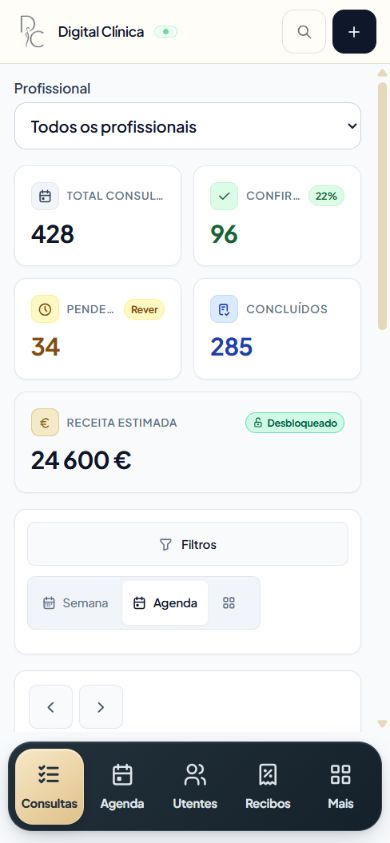

# Mobile admin navigation and solution audit — 8 October 2026

Subsequent drawer sizing and dashboard request improvements are documented in the [follow-up verification report](dashboard-reads-followup.md).

The admin navigation now uses a spacious navy and champagne app dock with four primary destinations and a More sheet. The final production build, TypeScript check, regression suites, both database adapters and live HTTP workflows pass. Testing found an owner-unlock crash, which was corrected and verified in the final browser build.

## Changes and corrections

- Larger icons, stronger labels and a clearly highlighted selected tab; no overlapping count badges. Record totals remain available to assistive technology.
- Four primary destinations plus a native modal More sheet for reviews, treatments, team and analytics. The sheet also contains language, refresh, help, sign-out and new appointment actions.
- Phone and tablet navigation stays in the layout so it does not cover scrolling content. Desktop uses the sidebar from 1024 px. Safe-area spacing, landscape sizing, keyboard focus and reduced-motion styles are included.
- The mobile header keeps brand, search and new appointment visible. Secondary controls are available in More.
- Unavailable invoice counts display a dash instead of a misleading zero.
- Owner unlock previously enabled a revenue card while its cached admin response still omitted the protected revenue field. Formatting that undefined value crashed the dashboard. The card now shows a dash until data arrives, its type reflects the optional field, and unlocking refreshes appointment statistics. Three regression checks cover the transition, real zero/nonzero values and immediate hiding after locking.

## Automated validation

| Suite | Passing tests/checks | Evidence |
| --- | ---: | --- |
| Final regression suite, including owner-unlock correction | 176 | [regression-final.log](regression-final.log) |
| Dashboard/data/security audit | 36 | [dashboard.log](dashboard.log) |
| Demo generation and publishing isolation | 18 | [demo.log](demo.log) |
| Reset safety | 15 | [reset.log](reset.log) |
| Scheduling, patient integrity, audit remediation, treatments and WhatsApp with the libSQL adapter | 150 | [libsql.log](libsql.log) |
| Final real HTTP workflows and adversarial concurrency | 20 | [workflows-final.log](workflows-final.log) |
| **Total suite executions** | **415** | Tests intentionally overlap between adapters and suites |

An additional **1,006 timezone/date equivalence assertions** passed, including daylight-saving cases: [timezone.log](timezone.log). The clean production build compiled successfully, completed TypeScript validation and generated all configured pages: [final-build.log](final-build.log).

The real HTTP suites cover public page responses, unknown pages, anonymous access rejection, login, owner access separation, configuration version conflicts, malformed requests, booking replay/idempotency, practitioner-specific capacity, rescheduling, closures, 20 simultaneous independent writes, recurring-plan retry consistency, session revocation and database/foreign-key integrity. Tests use disposable synthetic databases and disable external message delivery.

## Browser and responsive validation

Final geometry checks passed at 320×568, 375×812, 390×844, 430×932, 768×1024, 844×390, 1024×768 and 1440×900. The header and dock fit their viewport, every primary label fits its button, and the dock disappears at desktop widths. Subpixel differences below 1 px come from viewport emulation rounding. These checks assess navigation/header geometry; wide data tables keep their own horizontal scrolling.

Manual checks covered all primary destinations, More destinations, Portuguese/English/French labels, native modal focus, Escape dismissal, backdrop dismissal, closing on a desktop resize, owner authorization and invoice loading. Final browser verification reproduced the previously crashing unlock from the appointment screen: it now loads revenue and continues navigating without console errors. Public booking progressed from treatment through practitioner/date and available time selection to the patient form. Its retry action also recovered after the local test server was restarted. Booking submissions and concurrency were validated through the HTTP suites.

Twenty warm primary-tab selections measured **16.4 ms median** from captured click to the selected-tab DOM attribute update, with a **6.7–19.9 ms range**. This measures selection feedback only; it excludes API completion, visual paint and full content readiness.

The in-app browser paused animation-frame callbacks for approximately 1,000 ms despite reporting itself visible. Consequently, collected paint, frame-rate and event-duration samples are excluded from FPS, LCP and INP claims. The raw excluded samples and valid DOM observations are retained in [browser-results.json](browser-results.json). Reliable real-device animation fluidity and Core Web Vitals still require an unthrottled mobile browser or production field data.




## Latency methodology and limits

The finished code was rebuilt without instrumentation and audited on `127.0.0.1:3007` using the seeded local SQLite demo, a production Next.js server and synthetic records: 100 patients, 428 appointments and 287 invoices. Measurements include complete HTML/JSON body consumption. The endpoint sample contains 20 sequential requests per route, with the first observation and the remaining warm samples recorded separately. This is not a fresh-process cold-start experiment.

The load workload mixes public HTML, catalogue and availability reads, protected admin reads and health checks. It uses 200 ms think time per worker: 4 workers for 60 seconds, a 12-worker burst for 30 seconds, 4-worker recovery for 30 seconds and a 4-worker soak for 120 seconds. Worker count is concurrent request loops, not distinct human users. No writes are performed by the latency runner. Its separate checks verify anonymous access rejection, owner separation, actual SSE event delivery and logout revocation.

Local measurements do not include mobile network delay, CPU slowdown, CDN hosting, production Turso latency or external email/WhatsApp delivery. The short soak does not establish a long-term memory-leak or capacity limit. Public HTML response timing also excludes JavaScript execution, images and embedded third-party services. No existing production database contents or credentials are included in these artifacts.

## Final latency results

The final run completed **560 endpoint samples** across 28 routes and **5,248 successful mixed load reads**, with **zero failed load requests**. Raw values, response sizes, first observations, warm samples and memory snapshots are in [http-final-results.json](http-final-results.json); runner output is in [http-final.log](http-final.log).

| Workload | Successful reads | p95 full-response latency | Maximum |
| --- | ---: | ---: | ---: |
| Steady, 4 workers / 60 seconds | 1,049 | 42.3 ms | 182.5 ms |
| Burst, 12 workers / 30 seconds | 1,538 | 64.7 ms | 473.7 ms |
| Recovery, 4 workers / 30 seconds | 531 | 42.3 ms | 77.1 ms |
| Short soak, 4 workers / 120 seconds | 2,130 | 38.3 ms | 121.3 ms |

| Representative route | Sample median | Maximum |
| --- | ---: | ---: |
| Home HTML | 31.2 ms | 165.3 ms |
| Services HTML | 29.1 ms | 36.3 ms |
| Booking HTML | 29.9 ms | 40.6 ms |
| Admin HTML | 22.1 ms | 47.3 ms |
| Appointment summary API | 15.4 ms | 17.7 ms |
| Patient directory API | 15.3 ms | 22.3 ms |
| Invoice page API | 15.6 ms | 20.1 ms |
| Owner analytics API | 29.9 ms | 31.5 ms |

The endpoint audit reports the middle order statistic as its median and reserves p95 reporting for the larger load samples. It deliberately avoids assigning a p95 to only 20 observations. The longer burst tail demonstrates why medians alone should not be treated as worst-case latency. Recovery returned to the steady p95, and the short soak completed without request failures. The final audit ran alongside browser verification, so local-machine contention can affect individual samples.

The first actual SSE event arrived in **7.4 ms**. Sampled server RSS reached **456.58 MB** during the burst and ended at **411.73 MB**; sampled heap usage peaked at **229.63 MB** and ended at **67.89 MB**. Heap usage fell repeatedly during the run, consistent with garbage collection, but this short observation cannot establish the absence of a memory leak.

Host: Windows, Node.js 24.18.0, Next.js 16.3.6, local SQLite production demo. This audit establishes functional stability and bounded local response performance for the exercised workload; it does not certify production capacity or real-device frame rate.

## Reproduction

From `ryma-site`, run the following against disposable fixtures/local demo:

```powershell
npm run test:regression
npm run test:dashboard
npm run test:demo
npm run test:reset
$env:RYMA_TEST_ADAPTER = 'libsql'
node --test scripts/test-scheduling.cjs scripts/test-patient-integrity.cjs scripts/test-audit-remediation.cjs scripts/test-treatments.cjs scripts/test-whatsapp-booking.cjs
Remove-Item Env:RYMA_TEST_ADAPTER
node load-tests/audit-2026/validation-regression.cjs
npm run demo:build
node scripts/test-http-workflows.cjs
npm run demo:start
# In a second terminal, while the local demo is running:
$env:AUDIT_OUTPUT = 'docs/performance-audit-2026-10-08/http-final-results.json'
node scripts/audit-local-latency.cjs
Remove-Item Env:AUDIT_OUTPUT
```

`scripts/browser-performance-probe.js` is audit tooling only. The temporary copy in `public` and root-layout script tag were removed before the final build. It is never loaded by the delivered application. Browser screenshots and geometry were checked on the clean build. Earlier logs/results are retained for comparison; the final logs/results are the release evidence.
